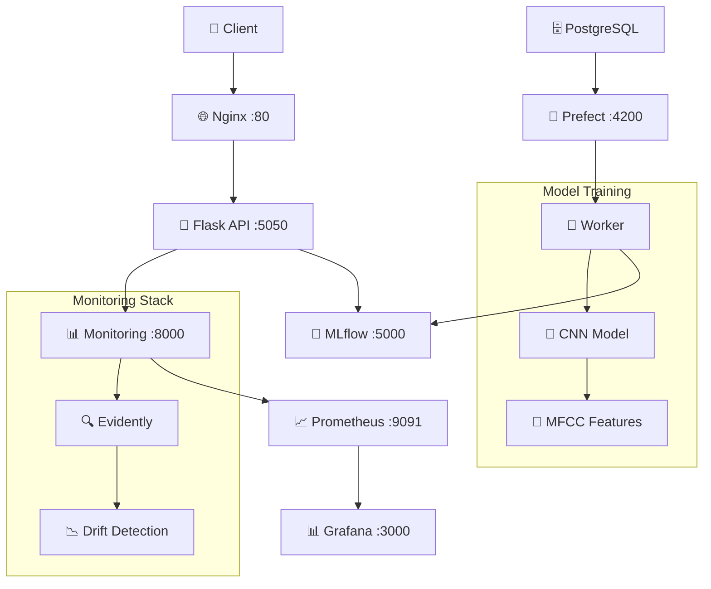

# 🎵 Music Genre Classification with MLOps

<p align="center">
  
</p>

## Context

Music genre classification is a challenging task in machine learning, as it requires analyzing complex audio data and identifying patterns unique to specific genres. With the rise of digital music platforms, automating this classification has become increasingly important for organizing, recommending, and retrieving music effectively.

## Practical Applications

- Automated music organization and tagging.

- Music recommendation systems for streaming platforms.

- Enhancing search and discovery features in digital music libraries.

- Assisting creators in identifying or categorizing their work.

- Audio Analysis Tools: Develop tools for musicologists and researchers to analyze genre trends.

- Educational Platforms: Aid in music education by categorizing and recommending tracks for learning.

## 🎯 **What This Project Does**

This project implements a **complete MLOps pipeline** for music genre classification using deep learning. It predicts music genres from audio files using a CNN model trained on MFCC features, classifying into 10 genres: rock, classical, metal, disco, blues, reggae, country, hiphop, jazz, and pop.

The application is designed to be user-friendly and operates via a Flask API, which allows users to upload an audio file and receive the predicted genre in JSON format. It goes beyond traditional machine learning by incorporating production-ready infrastructure, monitoring, and orchestration components.


### **🚀 Key Features**
- **🎵 Real-time Prediction API** with Flask + Nginx
- **🤖 CNN Model** trained on MFCC features (>75% accuracy)
- **🔬 MLflow Integration** for experiment tracking and model registry
- **🌊 Prefect Workflows** for orchestrated training pipelines
- **📊 Model Monitoring** with Evidently + Prometheus + Grafana
- **🐳 Production-Ready** containerized deployment
- **✅ Code quality & Comprehensive Testing** with CI/CD automation

This project serves as a **comprehensive MLOps template** demonstrating industry best practices for machine learning systems in production.

---

## 📖 **Documentation Structure**

| Document | Description | Quick Links |
|----------|-------------|-------------|
| **[🚀 Test & Run Guide](docs/TEST_RUN.md)** | Get up and running in 5 minutes | [Install](docs/QUICK_START.md#installation) • [Run](docs/QUICK_START.md#running) • [Test](docs/QUICK_START.md#testing) |
| **[🏗️ Architecture Guide](docs/ARCHITECTURE.md)** | Technical architecture and design | [Model](docs/ARCHITECTURE.md#model-architecture) • [Services](docs/ARCHITECTURE.md#service-architecture) • [Data Flow](docs/ARCHITECTURE.md#data-flow) |
| **[🐳 Deployment Guide](docs/DEPLOYMENT.md)** | Docker, production setup, scaling | [Docker Compose](docs/DEPLOYMENT.md#docker-compose) • [Production](docs/DEPLOYMENT.md#production) • [Scaling](docs/DEPLOYMENT.md#scaling) |
| **[🔄 API Documentation](docs/API.md)** | Complete API reference and examples | [Endpoints](docs/API.md#endpoints) • [Examples](docs/API.md#examples) • [Integration](docs/API.md#integration) |
| **[🛠️ Development Guide](docs/DEVELOPMENT.md)** | Development workflow and contribution | [Setup](docs/DEVELOPMENT.md#setup) • [Testing](docs/DEVELOPMENT.md#testing) • [Contributing](docs/DEVELOPMENT.md#contributing) |
| **[📊 Monitoring Guide](docs/MONITORING.md)** | Model monitoring and observability | [Dashboards](docs/MONITORING.md#dashboards) • [Alerts](docs/MONITORING.md#alerts) • [Metrics](docs/MONITORING.md#metrics) |
| **[🌊 Training Pipeline](docs/TRAINING.md)** | ML pipeline and experiment management | [Prefect](docs/TRAINING.md#prefect-workflows) • [MLflow](docs/TRAINING.md#mlflow-tracking) • [Automation](docs/TRAINING.md#automation) |

---

## ⚡ **Quick Start**
# 🚀 Quick Start Guide

Get the music genre classification MLOps pipeline running in 5 minutes!

### **Prerequisites**
- **Python 3.11+** 
- **Docker & Docker Compose**
- **Git**

### **1️⃣ Setup**
```bash
git clone https://github.com/arsonor/music-genre-classification-with-deep-learning
cd music-genre-classification-with-deep-learning

# Complete development setup (installs dependencies + pre-commit hooks)
make dev-setup  # Or: bash setup_tests.sh
```

### **2️⃣ Start All Services**
```bash
# Start entire MLOps stack
make docker-up

# Or alternatively:
docker-compose up --build -d
```

### **3️⃣ Test**
```bash
# Test with sample audio
make run-client

# Or manually:
curl -X POST -F "file=@test/blues.00000.wav" http://localhost/predict
```

### **4️⃣ Access Services**
- **🎵 API**: http://localhost (Nginx reverse proxy)
- **🔬 MLflow**: http://localhost:5000 (Experiment tracking)
- **🌊 Prefect**: http://localhost:4200 (Workflow orchestration)  
- **📊 Grafana**: http://localhost:3000 (Monitoring dashboards)
- **🔥 Prometheus**: http://localhost:9091 (Metrics collection)


📖 **Need more details?** See the [Complete Quick Start Guide](docs/QUICK_START.md)

---

## 🏗️ **Project Architecture**



### **Core Components**
- **🎵 Prediction API**: Flask service with model inference
- **🧠 CNN Model**: Architecture optimized for MFCC features  
- **🔬 Experiment Tracking**: MLflow for model versioning
- **🌊 Workflow Orchestration**: Prefect for training automation
- **📊 Model Monitoring**: Evidently + Prometheus + Grafana
- **🐳 Infrastructure**: Docker Compose orchestration

📖 **Deep dive into architecture**: [Architecture Guide](docs/ARCHITECTURE.md)

---

## 🗂️ **Project Structure**

```
music-genre-classification/
├── 📁 api/                     # Production API service
├── 📁 classifier/              # ML training pipeline  
├── 📁 monitoring/              # Model monitoring stack
├── 📁 nginx/                   # Reverse proxy
├── 📁 tests/                   # Comprehensive test suite
├── 📁 docs/                    # 📖 Documentation
├── 📁 notebooks/               # Jupyter experiments
├── 🐳 docker-compose.yaml     # Service orchestration
├── 🔧 Makefile                # Development commands
└── 📋 README.md               # This file
```

📖 **Detailed structure**: [Architecture Guide → Project Structure](docs/ARCHITECTURE.md#project-structure)

---

## **Conclusion & future improvements**

This project demonstrates the application of a Convolutional Neural Network (CNN) for music genre classification using the GTZAN dataset. The relatively high accuracy achieved (> 75% on validation and test sets) highlights the strength of CNNs in extracting and leveraging audio features like MFCCs for genre prediction.

However, while the GTZAN dataset has been foundational in advancing music genre classification, it's essential to be aware of its limitations (limited diversity, quality issues, overuse and overfitting). Researchers and developers often use additional or alternative datasets to achieve more robust and generalizable results.

Future improvements could focus on:

- Data Augmentation: Enhancing the dataset with techniques like pitch shifting, time stretching, or adding noise to increase diversity.
- Advanced Architectures: Exploring models like spectrogram-based transformers or hybrid CNN-RNN architectures for improved feature extraction and temporal modeling.
- Dataset Quality: Leveraging larger, more diverse, and well-labeled datasets to enhance robustness.
- Feature Engineering: Experimenting with additional audio features beyond MFCCs, such as chroma features or spectral contrast.

This project provides a solid foundation for music genre classification while acknowledging opportunities for refinement and further exploration.


## 🎓 **Learning Resources**

### **📚 Understand the Technologies**
- **[CNN for Audio](docs/ARCHITECTURE.md#model-architecture)**: How our model processes MFCC features
- **[MLOps Pipeline](docs/TRAINING.md)**: End-to-end ML workflow automation
- **[Model Monitoring](docs/MONITORING.md)**: Production model observability
- **[API Design](docs/API.md)**: RESTful service architecture

### **🛠️ Hands-On Tutorials**
- **[Training Your Own Model](docs/TRAINING.md#custom-training)**: Modify and retrain
- **[Custom Monitoring](docs/MONITORING.md#custom-dashboards)**: Create your own dashboards  
- **[API Integration](docs/API.md#integration-examples)**: Integrate with your app
- **[Production Deployment](docs/DEPLOYMENT.md#production)**: Deploy to cloud

### **📊 Notebooks & Experiments**
- **[EDA.ipynb](notebooks/EDA.ipynb)**: Exploratory data analysis
- **[data_preparation.ipynb](notebooks/data_preparation.ipynb)**: Feature engineering
- **[model_NN_classification.ipynb](notebooks/model_NN_classification.ipynb)**: Model selection

---

## 🤝 **Contributing**

We welcome contributions! Here's how to get started:

1. **📖 Read**: [Development Guide](docs/DEVELOPMENT.md)
2. **🔧 Setup**: `make dev-setup`
3. **✅ Test**: `make test`
4. **🎯 Code**: Follow our style guide
5. **📤 Submit**: Create a pull request

### **Quick Contribution Commands**
```bash
make format        # Format code
make lint          # Check code quality  
make test          # Run all tests
make ci            # Run full CI pipeline
```

📖 **Detailed guide**: [Development Guide → Contributing](docs/DEVELOPMENT.md#contributing)

---

## 📄 **License**

This project is licensed under the MIT License - see the [LICENSE](LICENSE) file for details.

---

## 🙏 **Acknowledgments**

- **GTZAN Dataset**: George Tzanetakis for the foundational music genre dataset
- **MLOps Community**: For inspiring production-ready ML practices
- **Open Source Libraries**: TensorFlow, MLflow, Prefect, Evidently, and more

---

## 📞 **Support & Community**

- **🐛 Issues**: [GitHub Issues](https://github.com/arsonor/music-genre-classification-with-deep-learning/issues)
- **📧 Contact**: [Linkedin](https://www.linkedin.com/in/martindornic/)
- **📖 Wiki**: [Project Wiki](https://github.com/arsonor/music-genre-classification-with-deep-learning/wiki)

---

<p align="center">
  <strong>🎵 Ready to classify some music? </strong><br>
  <a href="docs/QUICK_START.md">Get Started in 5 Minutes →</a>
</p>