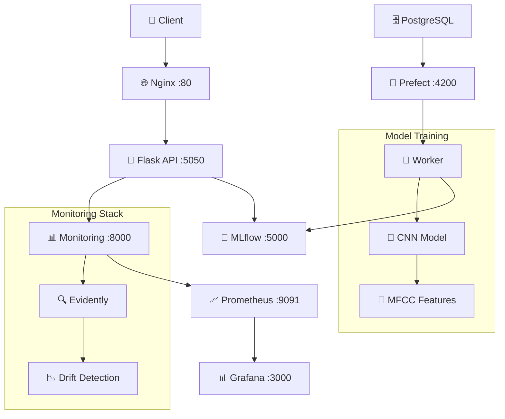

# 🎵 Music Genre Classification with MLOps

<p align="center">
  
</p>

## **Context**

Music genre classification is a challenging task in machine learning, as it requires analyzing complex audio data and identifying patterns unique to specific genres. With the rise of digital music platforms, automating this classification has become increasingly important for organizing, recommending, and retrieving music effectively.

## **Practical Applications**

- Automated music organization and tagging.

- Music recommendation systems for streaming platforms.

- Enhancing search and discovery features in digital music libraries.

- Assisting creators in identifying or categorizing their work.

- Audio Analysis Tools: Develop tools for musicologists and researchers to analyze genre trends.

- Educational Platforms: Aid in music education by categorizing and recommending tracks for learning.

## 🎯 **What This Project Does**

This project implements a **complete MLOps pipeline** for music genre classification using deep learning. It predicts music genres from audio files using a CNN model trained on MFCC features, classifying into 10 genres: rock, classical, metal, disco, blues, reggae, country, hiphop, jazz, and pop.

The application is designed to be user-friendly and operates via a Flask API, which allows users to upload an audio file and receive the predicted genre in JSON format. It goes beyond traditional machine learning by incorporating production-ready infrastructure, monitoring, and orchestration components.


### **🚀 Key Features**
- **🎵 Real-time Prediction API** with Flask + Nginx
- **🤖 CNN Model** trained on MFCC features (>75% accuracy)
- **🔬 MLflow Integration** for experiment tracking and model registry
- **🌊 Prefect Workflows** for orchestrated training pipelines
- **📊 Model Monitoring** with Evidently + Prometheus + Grafana
- **🐳 Production-Ready** containerized deployment
- **✅ Code quality & Comprehensive Testing** with CI/CD automation

This project serves as a **comprehensive MLOps template** demonstrating industry best practices for machine learning systems in production.

---

## 📖 **Documentation Structure**

| Document | Description | Quick Links |
|----------|-------------|-------------|
| **[🚀 Test & Run Guide](docs/TEST_RUN.md)** | Get up and running in 5 minutes | [Install](docs/QUICK_START.md#installation) • [Run](docs/QUICK_START.md#running) • [Test](docs/QUICK_START.md#testing) |
| **[🏗️ Architecture Guide](docs/ARCHITECTURE.md)** | Technical architecture and design | [Structure](docs/ARCHITECTURE.md#project-structure) • [Services](docs/ARCHITECTURE.md#service-architecture) • [Data Flow](docs/ARCHITECTURE.md#data-flow) |
| **[🔄 API Documentation](docs/API.md)** | Complete API reference and examples | [Endpoints](docs/API.md#-api-endpoints) • [Integration](docs/API.md#-model-loading-strategy) |
| **[📊 Monitoring Guide](docs/MONITORING.md)** | Model monitoring and observability | [Dashboards](docs/MONITORING.md#dashboards) • [Alerts](docs/MONITORING.md#alerts) • [Metrics](docs/MONITORING.md#metrics) |
| **[🌊 Training Pipeline](docs/TRAINING.md)** | ML pipeline and experiment management | [Prefect](docs/TRAINING.md#prefect-workflow-orchestration) • [MLflow](docs/TRAINING.md#mlflow-experiment-tracking) • [Automation](docs/TRAINING.md#pipeline-triggers) |
| **[🛠️ Model Development Guide](docs/MODEL_DEV.md)** | From raw audio dataset to a deep learning model | [Dataset](docs/MODEL_DEV.md#dataset-description) • [Architecture](docs/MODEL_DEV.md#-model-architecture) • [Notebooks](docs/MODEL_DEV.md#notebooks) |

---

## ⚡ **Quick Start Guide**

The easiest way to run a first prediction for testing the app is to use **docker-compose**.  
And the fastest way is to run it in a **GitHub codespace**.

### **Prerequisites (include in a codespace)**
- **Python 3.11+** 
- **Docker & Docker Compose**
- **Git**

### **1️⃣ Create a Codespace on main**

### **2️⃣ Start only the required services for inference**
```bash
docker-compose up --build mlflow api nginx -d
```
### **3️⃣ Test**
```bash
# With an audio file in the test folder:
python client.py --file audio_files_test/blues.00000.wav

# Test the entire folder:
python client.py --file audio_files_test/
# or with Makefile:
make run-client
```
The first prediction is slow (20-30s) because:

- MLflow model loading: Downloads model from registry
- Library initialization: librosa, tensorflow, etc.
- Audio processing: MFCC feature extraction
- Model inference: First prediction through neural network

Subsequent predictions will be much faster (almost instantaneous) since the model stays loaded in memory.


📖 **Want to go further?** See the [Complete Test & Run Guide](docs/TEST_RUN.md)

---

## 🏗️ **Project Architecture**




📖 **Deep dive into architecture**: [Architecture Guide](docs/ARCHITECTURE.md)

---

## 🗂️ **Project Structure**

```
music-genre-classification/
├── 📁 api/                     # Production API service
├── 📁 classifier/              # ML training pipeline  
├── 📁 monitoring/              # Model monitoring stack
├── 📁 nginx/                   # Reverse proxy
├── 📁 tests/                   # Comprehensive test suite
├── 📁 docs/                    # 📖 Documentation
├── 📁 notebooks/               # Jupyter experiments
├── 🐳 docker-compose.yaml     # Service orchestration
├── 🔧 Makefile                # Development commands
└── 📋 README.md               # This file
```

📖 **Detailed structure**: [Architecture Guide → Project Structure](docs/ARCHITECTURE.md#project-structure)

---

## **Conclusion & future improvements**

### MLOps Architecture
This project implements a production-ready MLOps pipeline featuring containerized microservices with Flask API, Nginx reverse proxy, and comprehensive monitoring through Prometheus and Grafana. The architecture leverages Prefect for workflow orchestration, MLflow for experiment tracking and model registry, and Evidently for model drift detection. Key strengths include automated CI/CD pipelines, real-time monitoring, and scalable containerized deployment.

**Future MLOps improvements:**
* Complete Prefect flow integration from raw data ingestion to model deployment
* Automated hyperparameter optimization workflows with CI integration
* Enhanced data source diversity for improved Evidently monitoring metrics
* Cloud-native streaming deployment infrastructure
* Continuous deployment automation through Prefect scheduling

### ML Model Development
This project demonstrates the application of a Convolutional Neural Network (CNN) for music genre classification using the GTZAN dataset. The relatively high accuracy achieved (> 75% on validation and test sets) highlights the strength of CNNs in extracting and leveraging audio features like MFCCs for genre prediction.

However, while the GTZAN dataset has been foundational in advancing music genre classification, it's essential to be aware of its limitations (limited diversity, quality issues, overuse and overfitting). Researchers and developers often use additional or alternative datasets to achieve more robust and generalizable results.

**Future model improvements:**
* Data Augmentation: Enhancing the dataset with techniques like pitch shifting, time stretching, or adding noise to increase diversity
* Advanced Architectures: Exploring models like spectrogram-based transformers or hybrid CNN-RNN architectures for improved feature extraction and temporal modeling
* Dataset Quality: Leveraging larger, more diverse, and well-labeled datasets to enhance robustness
* Feature Engineering: Experimenting with additional audio features beyond MFCCs, such as chroma features or spectral contrast

This project provides a comprehensive MLOps template demonstrating industry best practices for machine learning systems in production, serving as a solid foundation for music genre classification while acknowledging opportunities for refinement and further exploration.


## 🎓 **Learning Resources**

### **📚 Understand the Technologies**
- **[CNN for Audio](docs/MODEL_DEV.md#model-architecture)**: How the model processes MFCC features
- **[MLOps Pipeline](docs/TRAINING.md)**: End-to-end ML workflow automation
- **[Model Monitoring](docs/MONITORING.md)**: Production model observability
- **[API Design](docs/API.md)**: RESTful service architecture

### **🛠️ Hands-On Tutorials**
- **[Training Your Own Model](docs/TRAINING.md#custom-training)**: Modify and retrain
- **[Custom Monitoring](docs/MONITORING.md#custom-dashboards)**: Create your own dashboards  
- **[API Integration](docs/API.md#integration-examples)**: Integrate with your app

### **📊 Notebooks & Experiments**
- **[EDA.ipynb](notebooks/EDA.ipynb)**: Exploratory data analysis
- **[data_preparation.ipynb](notebooks/data_preparation.ipynb)**: Feature engineering
- **[model_NN_classification.ipynb](notebooks/model_NN_classification.ipynb)**: Model selection
- **[data_testing.ipynb](monitoring/data_testing.ipynb)**: Ground-truth dataset for monitoring

---

## 📄 **License**

This project is licensed under the MIT License - see the [LICENSE](LICENSE) file for details.

---

## 🙏 **Acknowledgments**

- **GTZAN Dataset**: George Tzanetakis for the foundational music genre dataset
- **Alexey Grigorev**: for the creation and supervision of these ML & MLOps Zoomcamp without which this project would not have been possible. I would like to thank him as well for all his valuable teaching and support.
- **MLOps Zoomcamp Community**: For inspiring production-ready ML practices
- **Open Source Libraries**: TensorFlow, MLflow, Prefect, Evidently, and more

---

## 📞 **Support, Contribution & Community**

- **🐛 Issues**: [GitHub Issues](https://github.com/arsonor/music-genre-classification-with-deep-learning/issues)
- **📤 Submit**: [Create a pull request](https://github.com/arsonor/music-genre-classification-with-deep-learning/pulls)
- **📧 Contact**: [Linkedin](https://www.linkedin.com/in/martindornic/)
- **📖 Wiki**: [Project Wiki](https://github.com/arsonor/music-genre-classification-with-deep-learning/wiki)

---

<p align="center">
  <strong>🎵 Ready to classify some music? </strong><br>
  <a href="docs/TEST_RUN.md">Get Started here →</a>
</p>