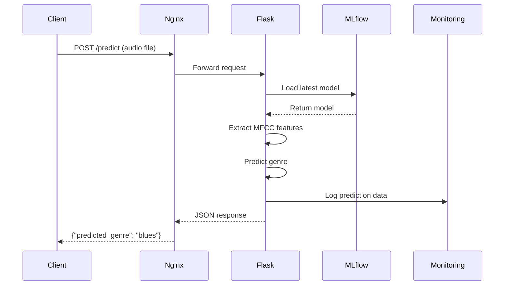

## 🔁 **Prediction Service (API + Nginx + MLflow)**

The prediction service provides a **production-ready API** for music genre classification with enterprise-grade features.

### **🏗 Service Architecture**



### **🎵 API Endpoints**

**POST `/predict`**
- **Input**: Audio file (WAV format recommended)
- **Optional**: `actual_genre` parameter for monitoring
- **Output**: JSON with predicted genre
- **Features**: MFCC extraction, model inference, data logging

```bash
# Example requests
curl -X POST -F "file=@test/blues.00000.wav" http://localhost/predict

# With actual genre for monitoring
curl -X POST \
  -F "file=@test/jazz.00000.wav" \
  -F "actual_genre=jazz" \
  http://localhost/predict

# Response format
{
  "predicted_genre": "blues"
}
```

### **🧠 Model Loading Strategy**

**MLflow Integration**:
```python
# Singleton pattern with MLflow model registry
def Genre_Prediction_Service():
    if not _instance:
        # Load latest model version from MLflow registry
        client = MlflowClient()
        versions = client.search_model_versions(f"name='{MODEL_NAME}'")
        latest_version = max(versions, key=lambda v: int(v.version))
        model_uri = f"models:/{MODEL_NAME}/{latest_version.version}"
        model = mlflow.keras.load_model(model_uri)
    return _instance
```

**Key Features**:
- **Automatic versioning**: Always loads latest registered model
- **Singleton pattern**: Model loaded once, reused for all requests
- **Error handling**: Graceful degradation on model loading failures
- **MLflow integration**: Seamless model registry connectivity

### **🔊 Audio Processing Pipeline**

**MFCC Feature Extraction**:
```python
def extract_mean_mfcc(audio_file_path):
    # Load audio at 22050 Hz sample rate
    signal, sample_rate = librosa.load(audio_file_path, sr=22050)
    
    # Extract 13 MFCC coefficients
    mfcc = librosa.feature.mfcc(
        y=signal, sr=sample_rate, 
        n_mfcc=13, n_fft=2048, hop_length=512
    )
    
    # Return mean across time dimension
    return np.mean(mfcc, axis=1)  # Shape: (13,)
```

**Processing Steps**:
1. **Audio normalization** to 22050 Hz sample rate
2. **MFCC extraction** with 13 coefficients  
3. **Temporal averaging** for fixed-size feature vector
4. **Model prediction** with confidence scores
5. **Genre mapping** to human-readable labels

### **🌐 Nginx Reverse Proxy**

**Production Benefits**:
- **Load balancing**: Multiple Flask instances support
- **SSL termination**: HTTPS certificate management
- **Static file serving**: Efficient asset delivery
- **Request buffering**: Improved performance under load
- **Security headers**: Additional protection layer

**Configuration Highlights**:
```nginx
upstream flask_app {
    server api:5050;  # Internal Docker network
}

server {
    listen 80;
    location /predict {
        proxy_pass http://flask_app;
        proxy_set_header Host $host;
        proxy_set_header X-Real-IP $remote_addr;
    }
}
```

### **📊 Data Logging for Monitoring**

**Prediction Logging**:
- **MFCC features**: 13-dimensional feature vectors
- **Predictions**: Model outputs with confidence
- **Ground truth**: Optional actual genres for validation
- **Timestamps**: Request timing for drift analysis
- **Storage**: Parquet format for efficient analysis

**Monitoring Integration**:
```python
# Log prediction data to monitoring/data/current.parquet
df_row = pd.DataFrame([mfcc_vector], columns=[f"mfcc_{i+1}" for i in range(13)])
df_row["predicted_genre"] = predicted_genre
df_row["actual_genre"] = actual_genre  # Optional
df_combined.to_parquet(CURRENT_PARQUET_PATH, index=False)
```

---