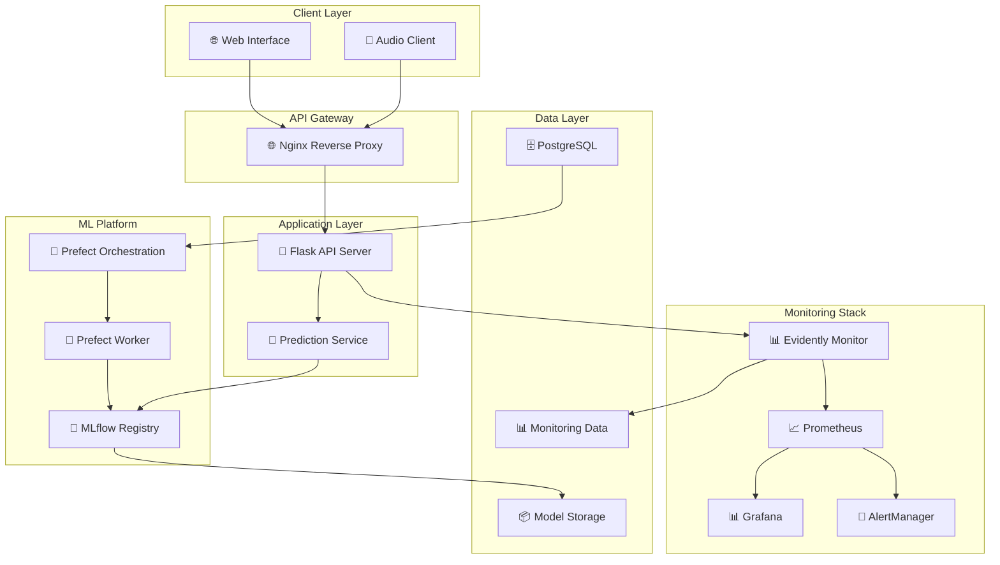
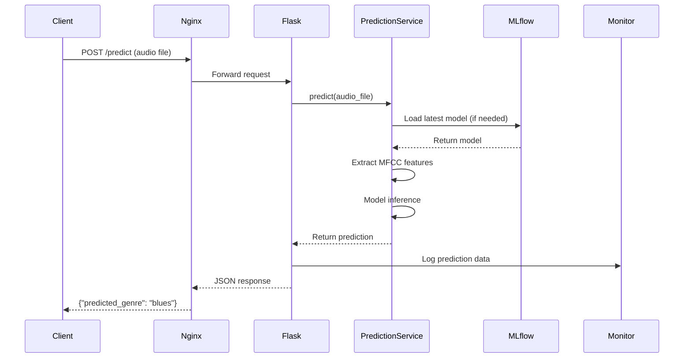
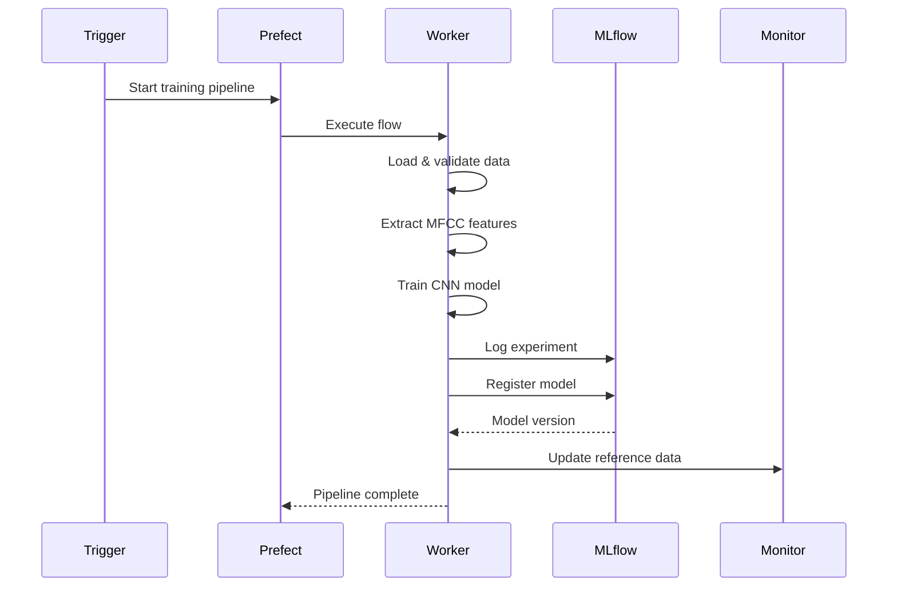
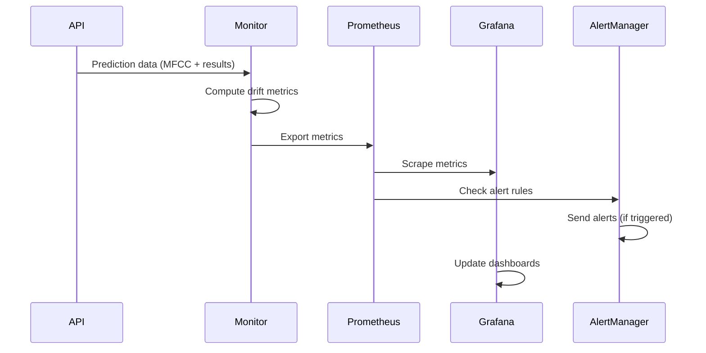

# 🏗️ Architecture Guide

This document provides a comprehensive overview of the system architecture, design decisions, and technical implementation details.

## Table of Contents
- [System Overview](#system-overview)
- [Service Architecture](#service-architecture)
- [Data Flow](#data-flow)
- [Project Structure](#project-structure)
- [Technology Stack](#technology-stack)
- [Design Decisions](#design-decisions)

## System Overview



## Service Architecture

### API Service Design

#### Flask Application Structure
```python
# api/server.py - RESTful API with monitoring integration
app = Flask(__name__)

@app.route('/predict', methods=['POST'])
def predict():
    # 1. Receive audio file upload
    audio_file = request.files['file']
    
    # 2. Get prediction from singleton service
    gps = Genre_Prediction_Service()
    predicted_genre = gps.predict(audio_file_path)
    
    # 3. Extract MFCC features for monitoring
    mfcc_vector = gps.extract_mean_mfcc(audio_file_path)
    
    # 4. Log prediction data for drift detection
    log_prediction_data(mfcc_vector, predicted_genre, actual_genre)
    
    # 5. Return JSON response
    return jsonify({"predicted_genre": predicted_genre})
```

#### Singleton Prediction Service
```python
# api/genre_prediction_service.py
class _Genre_Prediction_Service:
    _instance = None
    model = None
    
    def predict(self, audio_file_path):
        # Load model from MLflow registry (lazy loading)
        if self.model is None:
            self.model = self._load_latest_model()
        
        # Extract features and predict
        mfcc_features = self.extract_mean_mfcc(audio_file_path)
        prediction = self.model.predict(mfcc_features.reshape(1, -1))
        return self._map_prediction_to_genre(prediction)
    
    def _load_latest_model(self):
        # Connect to MLflow registry
        client = MlflowClient()
        versions = client.search_model_versions(f"name='{MODEL_NAME}'")
        latest_version = max(versions, key=lambda v: int(v.version))
        
        # Load model
        model_uri = f"models:/{MODEL_NAME}/{latest_version.version}"
        return mlflow.keras.load_model(model_uri)

# Factory function implementing singleton pattern
def Genre_Prediction_Service():
    if _Genre_Prediction_Service._instance is None:
        _Genre_Prediction_Service._instance = _Genre_Prediction_Service()
    return _Genre_Prediction_Service._instance
```

### Nginx Reverse Proxy

Nginx is a reverse proxy server that enhances security, scalability, performance, and user experience:

- Scalability: If you expand the app to multiple instances or need load balancing, Nginx can handle it.
- Performance: By offloading tasks like static file serving, caching, and SSL termination, Nginx improves the overall performance of your application.
- Simplicity for Clients: Users interact with the app through Nginx on port 80, eliminating the need to know internal port configurations.

#### Configuration for Production
```nginx
# nginx/nginx.conf
upstream flask_app {
    server api:5050;  # Internal Docker network
}

server {
    listen 80;
    client_max_body_size 50M;  # Allow large audio file uploads
    
    location /predict {
        proxy_pass http://flask_app;
        proxy_set_header Host $host;
        proxy_set_header X-Real-IP $remote_addr;
        proxy_set_header X-Forwarded-For $proxy_add_x_forwarded_for;
        proxy_set_header X-Forwarded-Proto $scheme;
        
        # Timeouts for audio processing
        proxy_connect_timeout 60s;
        proxy_send_timeout 60s;
        proxy_read_timeout 60s;
    }
    
    location /health {
        proxy_pass http://flask_app/health;
    }
}
```

#### Benefits of Reverse Proxy
- **🚀 Performance**: Static file serving, connection pooling
- **🔒 Security**: Hide internal service details, SSL termination
- **📈 Scalability**: Load balancing across multiple Flask instances
- **🛡️ Protection**: Rate limiting, request buffering
- **📊 Logging**: Centralized access logs

### MLflow Integration

#### Model Registry Workflow
```python
# classifier/pipeline/train.py
def train_and_log_model(data_path):
    # Set up MLflow experiment
    mlflow.set_tracking_uri("http://mlflow:5000")
    mlflow.set_experiment("music_genre_classification")
    
    with mlflow.start_run():
        # Log hyperparameters
        mlflow.log_params({
            "epochs": 100,
            "batch_size": 32,
            "learning_rate": 0.001,
            "l2_regularization": 0.001
        })
        
        # Train model
        model = build_model(input_shape, l2_reg, learning_rate)
        history = model.fit(X_train, y_train, ...)
        
        # Log metrics
        test_accuracy = model.evaluate(X_test, y_test)[1]
        mlflow.log_metrics({
            "test_accuracy": test_accuracy,
            "best_val_accuracy": max(history.history['val_accuracy'])
        })
        
        # Log artifacts
        mlflow.log_figure(plot_training_history(history), "training_plot.png")
        
        # Register model
        mlflow.keras.log_model(
            model,
            artifact_path="model",
            registered_model_name="music_genre_tf_model"
        )
```

### Prefect Orchestration

#### Workflow Definition
```python
# classifier/prefect_flow.py
@flow(name="music-genre-pipeline")
def music_genre_pipeline():
    # Task 1: Data validation
    data_path = download_and_validate_data()
    
    # Task 2: Feature extraction
    features, labels = validate_data_task(data_path)
    
    # Task 3: Model training
    training_results = train_task(data_path)
    
    return training_results

@task
def train_task(file_path):
    # Integrates with MLflow for experiment tracking
    return train_and_log_model(file_path)
```

## Data Flow

### Prediction Data Flow


### Training Data Flow


### Monitoring Data Flow


## Project Structure

### Detailed Directory Layout

```
music-genre-classification/
├── 📁 api/                              # Production API service
│   ├── server.py                        # Flask REST API server
│   ├── genre_prediction_service.py      # Model inference service (singleton)
│   ├── Dockerfile.api                   # API container definition
│   └── requirements.txt                 # Python dependencies
│
├── 📁 classifier/                       # ML training pipeline
│   ├── 📁 models/
│   │   └── model.py                     # CNN architecture definition
│   ├── 📁 pipeline/
│   │   ├── train.py                     # Training logic with MLflow integration
│   │   └── features.py                  # Feature extraction pipeline
│   ├── 📁 utils/
│   │   └── data.py                      # Data processing utilities
│   ├── 📁 config/
│   │   └── mlflow_config.yaml           # Training hyperparameters
│   ├── 📁 data/
│   │   └── data_10.npz                  # Preprocessed MFCC features
│   ├── prefect_flow.py                  # Prefect workflow definition
│   ├── Dockerfile.prefect               # Training container
│   ├── requirements.txt                 # ML dependencies
│   └── prefect.yaml                     # Prefect deployment config
│
├── 📁 monitoring/                       # Model monitoring stack
│   ├── monitor.py                       # Evidently monitoring service
│   ├── 📁 grafana/
│   │   └── provisioning/
│   │       ├── dashboards/              # Pre-configured dashboards
│   │       │   └── json/
│   │       │       └── evidently_dashboard.json
│   │       └── datasources/             # Prometheus datasource config
│   │           └── prometheus.yaml
│   ├── prometheus.yml                   # Prometheus scraping configuration
│   ├── alertmanager.yml                 # Alert routing configuration
│   ├── 📁 alert_rules/
│   │   └── model_alerts.yml             # Custom alert definitions
│   ├── Dockerfile.monitoring            # Monitoring service container
│   ├── requirements.txt                 # Monitoring dependencies
│   └── 📁 data/                         # Monitoring data storage
│       ├── current.parquet              # Live prediction data
│       └── reference.parquet            # Training reference data
│
├── 📁 nginx/                            # Reverse proxy
│   ├── nginx.conf                       # Nginx configuration
│   └── Dockerfile.nginx                 # Nginx container
│
├── 📁 alert_trigger/                    # Alert webhook system
│   ├── webhook.py                       # Prefect pipeline trigger
│   └── Dockerfile.webhook               # Webhook container
│
├── 📁 tests/                            # Comprehensive test suite
│   ├── test_server.py                   # API endpoint tests
│   ├── test_genre_prediction_service.py # Model service tests
│   ├── test_classifier.py               # ML pipeline tests
│   ├── test_monitoring.py               # Monitoring system tests
│   ├── test_integration.py              # End-to-end integration tests
│   ├── conftest.py                      # Pytest configuration & fixtures
│   └── requirements-test.txt            # Testing dependencies
│
├── 📁 notebooks/                        # Jupyter experiments & analysis
│   ├── EDA.ipynb                        # Exploratory data analysis
│   ├── data_preparation.ipynb           # Feature engineering experiments
│   └── model_NN_classification.ipynb    # Model architecture experiments
│
├── 📁 test/                             # Sample audio files for testing
│   ├── blues.00000.wav                  # Sample blues audio
│   ├── jazz.00000.wav                   # Sample jazz audio
│   ├── rock.00000.wav                   # Sample rock audio
│   └── [other_genres].00000.wav         # Additional genre samples
│
├── 📁 docs/                             # Comprehensive documentation
│   ├── QUICK_START.md                   # Get started in 5 minutes
│   ├── ARCHITECTURE.md                  # This file - system architecture
│   ├── API.md                           # API reference & examples
│   ├── DEPLOYMENT.md                    # Production deployment guide
│   ├── DEVELOPMENT.md                   # Development workflow
│   ├── MONITORING.md                    # Monitoring & observability
│   └── TRAINING.md                      # ML pipeline documentation
│
├── 🐳 docker-compose.yaml               # Multi-service orchestration
├── 🔧 Makefile                          # Development automation
├── ⚙️ .pre-commit-config.yaml           # Code quality automation
├── 🧪 run_tests.py                      # Intelligent test runner
├── 🔍 check_code_quality.py             # Code linting & formatting
├── 📋 setup_tests.sh                    # Environment setup script
├── 🎵 client.py                         # API test client
├── 📄 requirements-quality.txt          # Code quality tools
├── 🔄 .github/workflows/ci-tests.yml    # GitHub Actions CI/CD
└── 📖 README.md                         # Main project documentation
```

### Component Responsibilities

#### 🎵 **API Layer** (`api/`)
- **Purpose**: Production-ready REST API for music genre predictions
- **Key Features**: 
  - Audio file upload handling
  - MFCC feature extraction
  - Model inference via singleton pattern
  - Prediction logging for monitoring
  - Error handling and validation

#### 🤖 **ML Pipeline** (`classifier/`)
- **Purpose**: Training pipeline with experiment tracking
- **Key Features**:
  - CNN model architecture optimized for MFCC
  - Prefect workflow orchestration
  - MLflow experiment logging
  - Automated model registration
  - Hyperparameter configuration management

#### 📊 **Monitoring Stack** (`monitoring/`)
- **Purpose**: Model performance monitoring and drift detection
- **Key Features**:
  - Evidently-based drift detection
  - Prometheus metrics export
  - Pre-configured Grafana dashboards
  - Alert rule definitions
  - Data quality monitoring

#### 🧪 **Testing Framework** (`tests/`)
- **Purpose**: Comprehensive quality assurance
- **Key Features**:
  - Unit tests for all components
  - Integration tests for service interactions
  - Mock-based testing for external dependencies
  - Performance and load testing
  - Code coverage reporting

#### 🔷 **Infrastructure** (`nginx/`, `docker-compose.yaml`)
- **Purpose**: Containerized deployment
- **Key Features**:
    - Nginx reverse proxy
    - Service orchestration
    - Development tools.


## Technology Stack

### Core Technologies

#### **Backend & API**
- **🐍 Python 3.11+**: Main programming language
- **🌶️ Flask**: Lightweight web framework for REST API
- **🦄 Gunicorn**: WSGI HTTP server for production
- **🌐 Nginx**: Reverse proxy and load balancer
- **🐳 Docker**: Containerization platform

#### **Machine Learning**
- **🧠 TensorFlow 2.x**: Deep learning framework
- **🎵 Librosa**: Audio processing and feature extraction
- **📊 NumPy**: Numerical computing
- **🐼 Pandas**: Data manipulation and analysis
- **📈 Scikit-learn**: ML utilities and preprocessing

#### **MLOps Platform**
- **🔬 MLflow**: Experiment tracking and model registry
- **🌊 Prefect**: Workflow orchestration
- **🔍 Evidently**: Model monitoring and drift detection
- **📈 Prometheus**: Metrics collection and alerting
- **📊 Grafana**: Visualization and dashboards

#### **Data Storage**
- **🗄️ PostgreSQL**: Prefect metadata storage
- **📦 Local Storage**: MLflow artifacts and model files
- **📄 Parquet**: Efficient columnar data storage
- **🗂️ YAML**: Configuration management

#### **Development & Testing**
- **🧪 Pytest**: Testing framework
- **⚫ Black**: Code formatting
- **🔤 isort**: Import sorting
- **🔍 Pylint**: Static code analysis
- **🪝 Pre-commit**: Git hooks for code quality

### Technology Justification

#### **Why TensorFlow over PyTorch?**
- **Mature production ecosystem**: TF Serving, TF Lite for deployment
- **MLflow integration**: Seamless model logging and registry
- **Keras high-level API**: Rapid prototyping and development
- **Industry adoption**: Wide enterprise support

#### **Why Flask over FastAPI?**
- **Simplicity**: Minimal boilerplate for this use case
- **Mature ecosystem**: Extensive documentation and community
- **MLflow compatibility**: Well-tested integration
- **Deployment flexibility**: Easy containerization

#### **Why Prefect over Airflow?**
- **Modern Python**: Native Python workflow definition
- **Development experience**: Better debugging and testing
- **Cloud-native**: Designed for distributed execution
- **Monitoring**: Built-in observability features

#### **Why Evidently over Custom Monitoring?**
- **ML-specific**: Designed for model monitoring use cases
- **Drift detection**: Advanced statistical tests out-of-the-box
- **Visualization**: Rich HTML reports and dashboard integration
- **Integration**: Works well with Prometheus ecosystem

## Design Decisions

### Architectural Patterns

#### **Microservices Architecture**
```yaml
Services:
  - API Service: Handles HTTP requests and responses
  - Prediction Service: Encapsulates model inference logic
  - Training Service: Manages ML pipeline execution
  - Monitoring Service: Tracks model performance
  - Proxy Service: Routes and balances traffic
```

**Benefits**:
- **🔄 Independent scaling**: Scale services based on demand
- **🛠️ Technology flexibility**: Different tech stacks per service
- **🚀 Independent deployment**: Deploy services separately
- **🔍 Fault isolation**: Failures don't cascade across services

#### **Singleton Pattern for Model Loading**
```python
# Ensures model is loaded once and reused across requests
class _Genre_Prediction_Service:
    _instance = None
    model = None
    
    @classmethod
    def get_instance(cls):
        if cls._instance is None:
            cls._instance = cls()
            cls._instance.model = load_model_from_mlflow()
        return cls._instance
```

**Benefits**:
- **⚡ Performance**: Avoid reloading model on each request
- **💾 Memory efficiency**: Single model instance in memory
- **🔄 Thread safety**: Controlled access to shared resources

#### **Event-Driven Monitoring**
```python
# Prediction events trigger monitoring pipeline
@app.route('/predict', methods=['POST'])
def predict():
    # 1. Make prediction
    result = prediction_service.predict(audio_file)
    
    # 2. Emit monitoring event
    monitoring_service.log_prediction(features, result, ground_truth)
    
    return result
```

**Benefits**:
- **📊 Real-time monitoring**: Immediate drift detection
- **🔄 Decoupled architecture**: Monitoring doesn't block predictions
- **📈 Scalable data collection**: Async event processing

### Data Design Decisions

#### **MFCC Feature Choice**
**Why MFCC over raw audio or spectrograms?**
- **📉 Dimensionality**: 13 coefficients vs thousands of spectrogram bins
- **🎵 Perceptual relevance**: Mimics human auditory perception
- **🔬 Research validation**: Proven effectiveness in audio classification
- **⚡ Computational efficiency**: Fast extraction and processing

#### **3-Second Audio Segments**
**Why 3 seconds instead of full 30-second clips?**
- **🎯 Data augmentation**: 10x more training samples per song
- **⚖️ Class balance**: Better distribution across genres
- **🧠 Model complexity**: Manageable sequence length for CNN
- **⚡ Inference speed**: Faster processing for real-time applications

#### **Parquet for Monitoring Data**
**Why Parquet over JSON or CSV?**
- **📦 Compression**: 50-80% smaller file sizes
- **🚀 Query performance**: Columnar format for analytics
- **🔢 Type safety**: Schema enforcement and validation
- **🐼 Pandas integration**: Native support for data analysis

### Security Considerations

#### **API Security**
```nginx
# nginx.conf security headers
add_header X-Frame-Options DENY;
add_header X-Content-Type-Options nosniff;
add_header X-XSS-Protection "1; mode=block";
add_header Strict-Transport-Security "max-age=31536000";

# File upload restrictions
client_max_body_size 50M;  # Limit file size
```

#### **Container Security**
```dockerfile
# Use non-root user in containers
RUN adduser --disabled-password --gecos '' appuser
USER appuser

# Minimal base images
FROM python:3.11-slim
```

#### **Network Security**
```yaml
# docker-compose.yaml - Internal networks
networks:
  internal:
    driver: bridge
    internal: true  # No external access

services:
  api:
    networks: [default, internal]
  database:
    networks: [internal]  # Database not exposed
```

### Performance Optimizations

#### **Model Serving**
- **🔄 Singleton pattern**: Single model instance per container
- **📦 Model caching**: MLflow model registry with local caching
- **⚡ Async processing**: Non-blocking prediction pipeline
- **🎯 Batch processing**: Group predictions when possible

#### **Data Processing**
- **📊 Vectorized operations**: NumPy for MFCC processing
- **🗜️ Data compression**: Parquet for monitoring data
- **📈 Incremental processing**: Stream processing for monitoring
- **💾 Memory management**: Efficient data structures

#### **Infrastructure**
- **🚀 Reverse proxy**: Nginx for static content and load balancing
- **📦 Container optimization**: Multi-stage builds, minimal images
- **📊 Resource limits**: CPU and memory constraints per service
- **🔄 Health checks**: Automated container restart on failures

---

**🔗 Related Documentation**:
- [🚀 Quick Start Guide](QUICK_START.md) - Get the system running
- [🔄 API Documentation](API.md) - API reference and examples
- [🐳 Deployment Guide](DEPLOYMENT.md) - Production deployment
- [📊 Monitoring Guide](MONITORING.md) - Observability setup
- [🌊 Training Pipeline](TRAINING.md) - ML workflow details