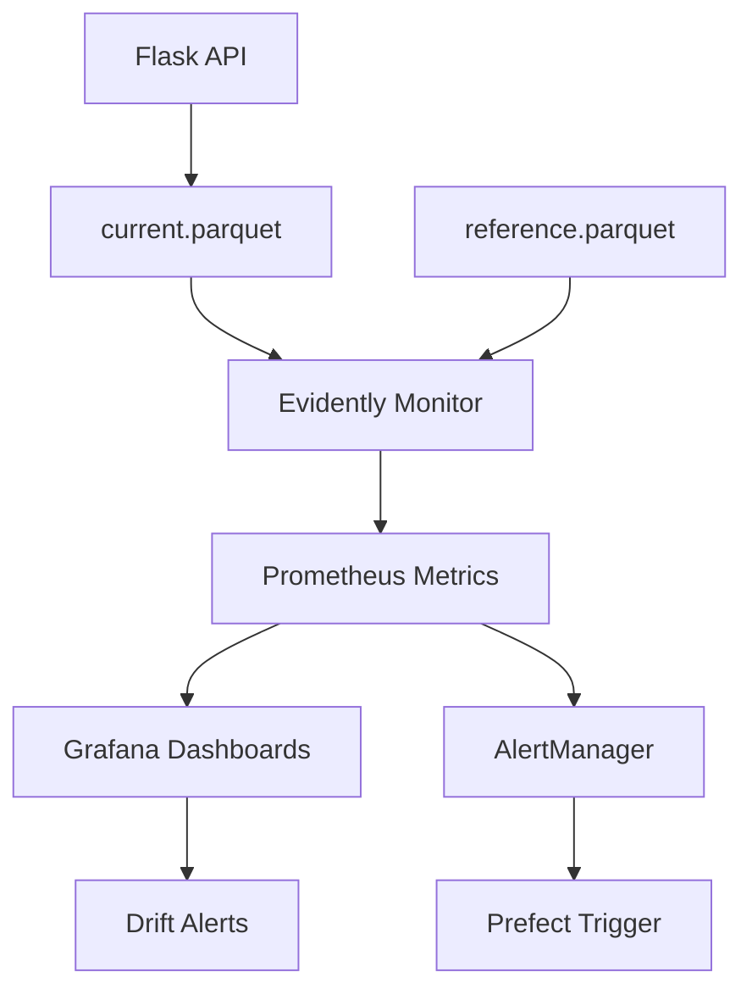

## 📈 **Monitoring (Evidently + Grafana + Prometheus)**

The monitoring system provides **real-time model performance tracking** with automated drift detection and alerting.

### **🔍 Architecture Overview**



### **📊 Evidently Model Monitoring**

**Data Drift Detection**:
```python
# monitoring/monitor.py
def generate_evidently_report(reference_data, current_data):
    """Generate comprehensive model monitoring report"""
    
    # Create monitoring suite
    monitoring_suite = TestSuite(tests=[
        TestNumberOfColumnsWithMissingValues(),
        TestNumberOfRowsWithMissingValues(), 
        TestNumberOfConstantColumns(),
        TestNumberOfDuplicatedRows(),
        TestColumnsType(),
        TestNumberOfDriftedColumns(),
    ])
    
    # Add feature-specific drift tests
    for i in range(1, 14):  # MFCC features 1-13
        monitoring_suite.tests.append(
            TestColumnDrift(column=f'mfcc_{i}')
        )
    
    # Run tests and extract metrics
    monitoring_suite.run(reference_data=reference_data, 
                        current_data=current_data)
    
    return extract_prometheus_metrics(monitoring_suite)
```

**Monitored Features**:
- **MFCC drift**: Statistical tests on all 13 MFCC coefficients
- **Data quality**: Missing values, duplicates, type consistency
- **Prediction drift**: Genre distribution changes over time
- **Volume monitoring**: Request rate and data volume tracking

### **📈 Prometheus Metrics Collection**

**Custom Metrics**:
```python
# Prometheus metric definitions
drift_metrics = {
    'mfcc_drift_p_value': Gauge('mfcc_drift_p_value', 'MFCC feature drift p-value', ['feature']),
    'prediction_distribution': Gauge('prediction_distribution', 'Genre prediction frequency', ['genre']),
    'data_quality_score': Gauge('data_quality_score', 'Overall data quality'),
    'rowcount': Gauge('rowcount', 'Number of prediction records'),
    'missing_values': Gauge('missing_values', 'Count of missing values'),
}

# Export to Prometheus
def export_metrics_to_prometheus(evidently_results):
    for feature, p_value in evidently_results.get('drift_scores', {}).items():
        drift_metrics['mfcc_drift_p_value'].labels(feature=feature).set(p_value)
```

**Metric Categories**:
- **🎵 Feature Drift**: MFCC coefficient distribution changes
- **📊 Data Quality**: Missing values, outliers, type mismatches  
- **🎯 Prediction Monitoring**: Genre distribution and confidence scores
- **📈 Volume Metrics**: Request rates and batch sizes

### **📊 Grafana Dashboards**

**Pre-configured Dashboards**:

**Model Performance Dashboard**:
- **Drift Detection Timeline**: P-values for all MFCC features over time
- **Prediction Distribution**: Genre classification frequency heatmap
- **Data Quality Metrics**: Missing values, row counts, type consistency
- **Alert Status**: Current drift alerts and thresholds

**Feature Monitoring Dashboard**:
- **MFCC Feature Drift**: Individual feature drift visualization
- **Statistical Tests**: Kolmogorov-Smirnov test results  
- **Distribution Comparisons**: Reference vs. current data histograms
- **Feature Correlation**: Cross-feature drift relationships

**System Health Dashboard**:
- **API Performance**: Response times, error rates, throughput
- **Container Metrics**: CPU, memory, disk usage per service
- **MLflow Tracking**: Model versions, experiment metrics
- **Prefect Flows**: Pipeline execution status and timing

### **🚨 Alerting System**

**Alert Rules**:
```yaml
# monitoring/alert_rules/model_alerts.yml
groups:
  - name: model_drift_alerts
    rules:
      - alert: MFCCFeatureDrift
        expr: mfcc_drift_p_value < 0.05
        for: 5m
        labels:
          severity: warning
        annotations:
          summary: "MFCC feature drift detected"
          description: "Feature {{ $labels.feature }} shows drift (p-value: {{ $value }})"
          
      - alert: DataQualityIssue  
        expr: missing_values > 100
        for: 2m
        labels:
          severity: critical
        annotations:
          summary: "Data quality degradation detected"
```

**Alert Channels**:
- **Webhook**: