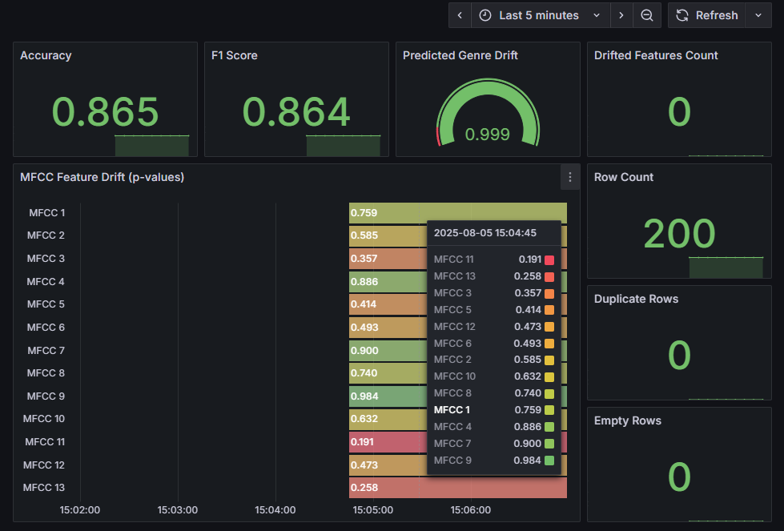

# 📊 Model Monitoring Guide

**Real-time model performance tracking** with automated drift detection and intelligent alerting.

---

## 🔍 **Architecture Overview**


**Data Flow**:
1. **API Predictions** → Logged to `current.parquet`
2. **Evidently** → Compares current vs reference data
3. **Prometheus** → Collects drift metrics every 30 seconds
4. **Grafana** → Visualizes metrics and triggers alerts
5. **AlertManager** → Routes alerts to Prefect webhook
6. **Prefect** → Automatically triggers model retraining

---

## 📈 **Evidently Model Monitoring**

### **Drift Detection Engine**

```python
# monitoring/run_monitoring.py
@app.route("/metrics")
def metrics():
    reference_path = "data/reference.parquet"
    current_path = "data/current.parquet"

    if not os.path.exists(reference_path):
        return Response("# reference.parquet not found\n", mimetype="text/plain")
    if not os.path.exists(current_path):
        return Response("# current.parquet not found\n", mimetype="text/plain")

    reference_df = pd.read_parquet(reference_path)
    current_df = pd.read_parquet(current_path)

    mfcc_features = [f"mfcc_{i}" for i in range(1, 14)]
    categories = sorted(reference_df["predicted_genre"].dropna().unique().tolist())

    multiclass_definition = DataDefinition(
        numerical_columns=mfcc_features,
        classification=[
            MulticlassClassification(
                target="actual_genre", prediction_labels="predicted_genre"
            )
        ],
    )

    reference_data = Dataset.from_pandas(
        reference_df, data_definition=multiclass_definition
    )
    current_data = Dataset.from_pandas(
        current_df, data_definition=multiclass_definition
    )
```

### **Monitored Features**

**🎵 Audio Feature Drift**:
- **MFCC 1-13**: Mel-frequency cepstral coefficients drift detection
- **Statistical Tests**: Kolmogorov-Smirnov test for distribution changes
- **P-value Tracking**: Drift significance scoring (p < 0.05 = drift)
- **Feature Correlation**: Cross-feature drift relationship analysis

**📊 Data Quality Monitoring**:
- **Missing Values**: Row and column completeness tracking
- **Data Types**: Schema consistency validation
- **Duplicates**: Duplicate record detection

**🎯 Prediction Monitoring**:
- **Genre Distribution**: Classification frequency analysis
- **Prediction Drift**: Output distribution changes
- **Performance Degradation**: Accuracy and F1-score trend monitoring

---

## 📊 **Prometheus Metrics Collection**

### **Custom Metrics Registry**

```python
# monitoring/metrics.py
metrics_list = [
        
        # Data Quality
        RowCount(),
        EmptyRowsCount(),
        DuplicatedRowCount(),
        *[MissingValueCount(column=col) for col in mfcc_features],

        # Audio Features Drift
        *[ValueDrift(column=col) for col in mfcc_features],
        DriftedColumnsCount(columns=mfcc_features),

        # Prediction Drift
        ValueDrift(column="predicted_genre"),
        CategoryCount(column="predicted_genre", categories=categories),

        # Classification Performance
        Accuracy(),
        F1Score(),
    ]
```

### **Metric Export Process**

```python
report = Report(metrics=metrics_list)
    results = report.run(
        reference_data=reference_data, current_data=current_data
    ).dict()

    output_lines = []
    output_lines.append("# HELP evidently_metric Evidently monitoring metric")
    output_lines.append("# TYPE evidently_metric gauge")

    for metric in results["metrics"]:
        raw_name = metric.get("metric_id", "unknown_metric")
        metric_id = prometheus_safe(raw_name)

        value = metric.get("value")

        if isinstance(value, (int, float)):
            output_lines.append(f"{metric_id} {value:.6f}")

        elif isinstance(value, dict):
            for sub_key, sub_val in value.items():
                if isinstance(sub_val, (int, float)):
                    sub_name = prometheus_safe(f"{metric_id}_{sub_key}")
                    output_lines.append(f"{sub_name} {sub_val:.6f}")

        else:
            try:
                numeric_val = float(value)
                output_lines.append(f"{metric_id} {numeric_val:.6f}")
            except (TypeError, ValueError):
                pass

    return Response("\n".join(output_lines) + "\n", mimetype="text/plain")
```

---

## 🎯 **Grafana Dashboard**

### **Evidently Monitoring Dashboard**

<p align="center">
  
</p>

**Key Visualizations**:

**Performance score**:
- **Accuracy and F1-Score**: Alert setup if below 0.85

**🔥 Real-time Drift Timeline**:
- **Time Series**: P-values for all 13 MFCC features over time
- **Threshold Line**: 0.05 p-value drift detection threshold
- **Color Coding**: Green (no drift) → Red (drift detected)
- **Interactive**: Zoom, pan, and hover for detailed metrics
- **Drifted Column Counts**: Alert setup over 3

**🎵 Prediction Genre Drift**:
- 0.05 p-value drift detection threshold

**📈 Data Quality Overview**:
- **Gauge Panels**: Row count, Duplicated Rows, Empty Rows
- **Status Indicators**: Green/Yellow/Red quality status


---

## 🚨 **Intelligent Alerting System**

### **Alert Rules Configuration**

```yaml
# monitoring/alert_rules/alerts.yml
groups:
  - name: model-monitoring-alerts
    interval: 10s
    rules:
      # Accuracy Alert
      - alert: AccuracyBelowThreshold
        expr: accuracy < 0.85
        for: 30s
        labels:
          severity: critical
        annotations:
          summary: "Model accuracy dropped below 0.85"
          description: "Current accuracy is {{ $value }}"

      # F1 Score Alert
      - alert: F1ScoreBelowThreshold
        expr: f1score_conf_matrix_true < 0.85
        for: 30s
        labels:
          severity: critical
        annotations:
          summary: "Model F1-score dropped below 0.85"
          description: "Current F1-score is {{ $value }}"

      # Predicted Genre Drift Alert
      - alert: PredictedGenreDriftLow
        expr: valuedrift_column_predicted_genre < 0.1
        for: 30s
        labels:
          severity: warning
        annotations:
          summary: "Predicted genre drift below 0.1"
          description: "Drift metric for predicted_genre is {{ $value }}"

      # Drifted Columns Count Alert
      - alert: TooManyDriftedColumns
        expr: driftedcolumnscount_columns_mfcc_1_mfcc_2_mfcc_3_mfcc_4_mfcc_5_mfcc_6_mfcc_7_mfcc_8_mfcc_9_mfcc_10_mfcc_11_mfcc_12_mfcc_13_drift_share_0_5_count > 3
        for: 30s
        labels:
          severity: warning
        annotations:
          summary: "More than 3 columns are drifting"
          description: "Drifted columns count is {{ $value }}"
```

### **Alert Routing & Channels**

```yaml
# monitoring/alertmanager.yml
global:
  resolve_timeout: 5m

route:
  receiver: "prefect-webhook"
  group_wait: 10s
  group_interval: 30s
  repeat_interval: 1h

receivers:
  - name: "prefect-webhook"
    webhook_configs:
      - url: "http://prefect-trigger:5080/trigger"
        send_resolved: true  
```

### **Automated Remediation**

**🔄 Auto-Retraining Triggers**:
- **Drift Threshold**: >3 features showing drift (p < 0.05)
- **Quality Degradation**: >10% missing values or data anomalies
- **Performance Drop**: Model accuracy below 70% threshold
- **Volume Anomalies**: Unusual prediction request patterns

**📞 Webhook Integration**:
```python
# alert_trigger/webhook.py
@app.route("/trigger", methods=["POST"])
def trigger():
    """
    Webhook endpoint to receive alerts and trigger retraining flow.

    Returns:
        tuple: Response message and HTTP status code
    """
    data = request.json
    print("Received alert:", data)

    # Check if this is an accuracy alert
    if data and "alerts" in data:
        for alert in data["alerts"]:
            if alert.get("labels", {}).get("alertname") == "AccuracyBelowThreshold":
                print("Triggering Prefect retrain flow...")
                trigger_prefect_flow()
                break

    return "OK", 200


def trigger_prefect_flow():
    """
    Trigger a Prefect flow deployment for model retraining.

    Makes an HTTP POST request to the Prefect API to create a new flow run.
    """
    # Call Prefect Deployment to trigger the flow
    # Replace with your deployment ID or use the name+version API
    deployment_id = os.getenv(
        "PREFECT_DEPLOYMENT_ID", "edf5202f-d8b6-4145-bc05-e75e15ff0417"
    )

    try:
        response = requests.post(
            f"{PREFECT_API_URL}/deployments/{deployment_id}/create_flow_run",
            json={"parameters": {}},
            timeout=REQUEST_TIMEOUT,
        )

        if response.status_code == 200:
            print("Prefect flow triggered successfully")
        else:
            print(
                f"Failed to trigger Prefect flow: {response.status_code} - {response.text}"
            )

    except requests.exceptions.Timeout:
        print(f"Request to Prefect API timed out after {REQUEST_TIMEOUT} seconds")
    except requests.exceptions.RequestException as e:
        print(f"Error calling Prefect API: {e}")
```

---

## 🛠️ **Configuration & Setup**

### **Starting Monitoring Services**

```bash
# Start complete monitoring stack
make monitoring-up

# Start individual services
docker-compose up -d prometheus grafana alertmanager monitoring

# View monitoring logs
docker-compose logs -f monitoring
```

### **Access Points**

| Service | URL | Credentials | Purpose |
|---------|-----|-------------|---------|
| **Grafana** | http://localhost:3000 | admin/admin | Dashboards & Alerts |
| **Prometheus** | http://localhost:9091 | None | Metrics Browser |
| **AlertManager** | http://localhost:9093 | None | Alert Management |
| **Monitoring API** | http://localhost:8000/metrics | None | Prometheus Metrics |

### **Data Persistence**

```yaml
# docker-compose.yaml volumes
volumes:
  grafana_data: # Grafana dashboards and settings
  prometheus_data: # Historical metrics storage
  ./monitoring/data:/app/monitoring/data # Reference and current data
```

---

## 📋 **Monitoring Checklist**

### **Daily Operations**

**✅ Morning Health Check**:
- [ ] Review overnight alerts in Grafana
- [ ] Check data quality metrics for anomalies
- [ ] Verify all monitoring services are running
- [ ] Review prediction volume and distribution

**✅ Weekly Model Review**:
- [ ] Analyze feature drift trends over past week
- [ ] Review model performance degradation patterns
- [ ] Check alert false positive rates
- [ ] Update drift detection thresholds if needed

**✅ Monthly Monitoring Audit**:
- [ ] Review and tune alert rules
- [ ] Analyze historical drift patterns
- [ ] Update reference data if needed
- [ ] Performance optimization of monitoring stack

### **Troubleshooting Guide**

**🔍 Common Issues**:

**Monitoring Service Down**:
```bash
# Check service status
docker-compose ps monitoring

# Restart monitoring stack
make monitoring-down && make monitoring-up

# Check logs for errors
docker-compose logs monitoring
```

**Missing Metrics in Grafana**:
```bash
# Verify Prometheus is scraping
curl http://localhost:9091/api/v1/targets

# Check monitoring endpoint
curl http://localhost:8000/metrics

# Restart Prometheus
docker-compose restart prometheus
```

**False Drift Alerts**:
```bash
# Update reference data
python monitoring/update_reference.py

# Adjust drift thresholds
# Edit monitoring/alert_rules/model_alerts.yml

# Reload Prometheus rules
curl -X POST http://localhost:9091/-/reload
```

---

## 📈 **Advanced Monitoring (to be implemented in the future)**

### **Custom Metrics Integration**

```python
# api/monitoring_integration.py
from prometheus_client import Counter, Histogram, Gauge

# Custom business metrics
custom_metrics = {
    'genre_popularity': Counter('genre_popularity_total', 
                               'Total predictions by genre', ['genre']),
    'user_satisfaction': Gauge('user_satisfaction_score', 
                              'User feedback score'),
    'model_latency': Histogram('model_inference_seconds', 
                              'Model inference time'),
}

@app.route('/predict', methods=['POST'])
def predict():
    start_time = time.time()
    
    # Model prediction logic
    result = model.predict(features)
    
    # Record custom metrics
    custom_metrics['genre_popularity'].labels(
        genre=result['predicted_genre']
    ).inc()
    
    custom_metrics['model_latency'].observe(
        time.time() - start_time
    )
    
    return jsonify(result)
```

### **A/B Testing Integration**

```python
# monitoring/ab_testing.py
def track_model_variants(prediction_data):
    """Track performance across different model versions"""
    
    variant_metrics = {
        'model_a_accuracy': Gauge('model_variant_accuracy', 
                                 'Model accuracy by variant', ['variant']),
        'model_a_latency': Histogram('model_variant_latency', 
                                   'Model latency by variant', ['variant']),
    }
    
    # Track metrics by model variant
    for variant, performance in prediction_data.items():
        variant_metrics['model_a_accuracy'].labels(
            variant=variant
        ).set(performance['accuracy'])
```

### **Model Performance Dashboards**

**Key Visualizations**:

**🔥 Real-time Drift Timeline**:
- **Time Series**: P-values for all 13 MFCC features over time
- **Threshold Line**: 0.05 p-value drift detection threshold
- **Color Coding**: Green (no drift) → Red (drift detected)
- **Interactive**: Zoom, pan, and hover for detailed metrics

**📊 Feature Drift Heatmap**:
- **Matrix View**: All MFCC features vs time periods
- **Intensity**: Color intensity represents drift severity
- **Pattern Detection**: Visual correlation between feature drifts
- **Alert Overlay**: Highlighted drift events

**🎵 Genre Distribution Monitor**:
- **Bar Chart**: Real-time prediction frequency by genre
- **Baseline Comparison**: Reference vs current distribution
- **Anomaly Detection**: Unusual genre prediction patterns
- **Trend Analysis**: Genre popularity shifts over time

**📈 Data Quality Overview**:
- **Gauge Panels**: Missing values, row count, quality score
- **Status Indicators**: Green/Yellow/Red quality status
- **Historical Trends**: Quality degradation over time
- **Alert Integration**: Visual alert status indicators

### **System Health Dashboard**

**🖥️ Infrastructure Monitoring**:
- **Container Metrics**: CPU, memory, disk usage per service
- **API Performance**: Response times, error rates, throughput
- **Database Health**: PostgreSQL connection status, query performance
- **Network Monitoring**: Inter-service communication latency

**🔬 MLflow Integration**:
- **Model Versions**: Currently deployed model version
- **Experiment Metrics**: Latest training run performance
- **Model Registry**: Production model status
- **Artifact Storage**: Model file availability

**🌊 Prefect Workflow Status**:
- **Flow Execution**: Real-time pipeline status
- **Task Monitoring**: Individual task success/failure rates
- **Queue Status**: Worker pool availability
- **Scheduling**: Upcoming and completed runs

### **Alert Status Dashboard**

**🚨 Active Alerts**:
- **Alert List**: Current active drift and quality alerts
- **Severity Levels**: Critical, Warning, Info classifications
- **Duration**: How long alerts have been active
- **Acknowledgment**: Manual alert acknowledgment system

**📊 Alert History**:
- **Timeline**: Historical alert patterns
- **Frequency Analysis**: Most common alert types
- **Resolution Time**: Average time to alert resolution
- **False Positive Rate**: Alert accuracy tracking

---

## 🎯 **Best Practices**

### **Monitoring Strategy**

**🎯 Threshold Setting**:
- **Conservative**: p < 0.01 for critical features
- **Balanced**: p < 0.05 for standard drift detection
- **Sensitive**: p < 0.1 for early warning systems

**📊 Reference Data Management**:
- **Update Frequency**: Monthly or after major model updates
- **Size**: Minimum 1000 samples for statistical significance
- **Representativeness**: Include all genres and audio qualities
- **Versioning**: Track reference data versions with models

**🔄 Alert Fatigue Prevention**:
- **Intelligent Grouping**: Combine related alerts
- **Progressive Escalation**: Warning → Critical → Action
- **Auto-Resolution**: Clear alerts when conditions normalize
- **Context Enrichment**: Include relevant metadata in alerts

### **Performance Optimization**

**📈 Monitoring Efficiency**:
- **Batch Processing**: Process monitoring data in batches
- **Sampling**: Use representative samples for large datasets
- **Caching**: Cache expensive drift calculations
- **Parallel Processing**: Parallelize feature-level drift tests

**💾 Storage Management**:
- **Data Retention**: 90 days for metrics, 30 days for raw data
- **Compression**: Use Parquet compression for historical data
- **Partitioning**: Partition data by date for efficient queries
- **Cleanup**: Automated cleanup of old monitoring data

---

**🎵 Congratulations!** You now have a comprehensive model monitoring system that provides real-time insights into your music genre classification model's performance and automatically triggers retraining when needed.

**Next Steps**: Explore the [Training Pipeline Guide](TRAINING.md) to understand how monitoring alerts trigger automated model retraining.