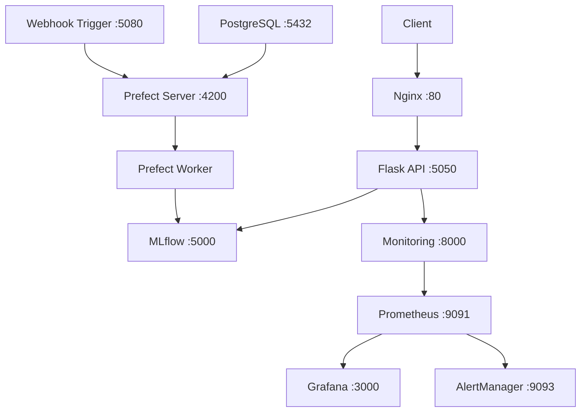

# 🚀 Quick Start Guide


## Prerequisites

Before you begin, ensure you have:
- **Python 3.11+** installed
- **Docker & Docker Compose** installed
- **Git** for cloning the repository
- **8GB RAM** recommended for running all services

## Installation

### 1️⃣ Clone the Repository
```bash
git clone https://github.com/arsonor/music-genre-classification-with-deep-learning
cd music-genre-classification-with-deep-learning
```

### 🚀 **1. Run the App Locally**
#### 📦 Step 1: Create a Virtual Environment
  ```sh
  python -m venv venv
  ```

#### ✅ Step 2: Activate the virtual environment:
- On macOS/Linux:  
  ```sh
  source venv/bin/activate
  ```
- On Windows (Git Bash):  
  ```sh
  source venv/Scripts/activate
  ```
- On Windows (Command Prompt):  
  ```sh
  venv\Scripts\activate
  ```

### 2️⃣ Complete Development Setup
```bash
# Option A: Using Makefile (recommended)
make dev-setup

# Option B: Manual setup
bash setup_tests.sh
```

This will:
- ✅ Install all Python dependencies
- ✅ Set up pre-commit hooks for code quality
- ✅ Validate the environment
- ✅ Create necessary directories

## Running

### 🐳 Start All Services (Docker)
```bash
# Option A: Using Makefile
make docker-up

# Option B: Direct Docker Compose
docker-compose up --build -d
```

This starts:
- **🎵 API Service** (Flask + Nginx) on port 80
- **🔬 MLflow** tracking server on port 5000
- **🌊 Prefect** workflow server on port 4200
- **📊 Grafana** monitoring on port 3000
- **📈 Prometheus** metrics on port 9091

### ⏱️ Wait for Services
```bash
# Check service status
docker-compose ps

# Watch logs (optional)
make docker-logs
```

## Testing

## ✅ **How to Test**

This project includes a **comprehensive testing framework** covering all components:

### **🚀 Quick Testing Commands**

```bash
# Run all tests
make test

# Run specific test suites
make test-unit           # Unit tests only
make test-integration    # Integration tests
make test-service        # API service tests
make test-monitoring     # Monitoring tests
make test-classifier     # ML pipeline tests

# Run with test coverage
make test-coverage

# Quick development cycle
make quick-test          # Format + unit tests (fast)
```

### **🧪 Test Categories**

**📊 API Tests (`test_server.py`)**
- Flask endpoint functionality
- Audio file upload handling
- JSON response validation
- Error handling scenarios

**🤖 Service Tests (`test_genre_prediction_service.py`)**
- Model loading and prediction logic
- MFCC feature extraction
- Singleton pattern implementation
- MLflow model registry integration

**🔬 ML Pipeline Tests (`test_classifier.py`)**
- Model architecture validation
- Training pipeline with MLflow mocking
- Data preparation and feature extraction
- Configuration handling

**📈 Monitoring Tests (`test_monitoring.py`)**
- Evidently drift detection
- Prometheus metrics generation
- Data validation and processing

**🔗 Integration Tests (`test_integration.py`)**
- End-to-end API workflow
- Service integration verification
- Data flow validation

### **🛠 Development Testing**

```bash
# Setup testing environment
bash setup_tests.sh

# Run tests with detailed output  
python run_tests.py -v

# Clean test artifacts
make clean
```

### **🎯 Test Coverage**

The test suite achieves **comprehensive coverage** across:
- ✅ **API endpoints** with realistic audio processing
- ✅ **ML model training** with mocked MLflow integration  
- ✅ **Monitoring systems** with synthetic data drift
- ✅ **Service integration** with containerized testing
- ✅ **Error handling** for production scenarios

---


### 🎵 Test the Prediction API
```bash
# Option A: Using test client
make run-client

# Option B: Manual curl request
curl -X POST -F "file=@test/blues.00000.wav" http://localhost/predict

# Expected response:
# {"predicted_genre": "blues"}
```

### ✅ Run Test Suite
```bash
# Quick tests
make quick-test

# Full test suite  
make test

# With coverage
make test-coverage
```

## Accessing Services

Once everything is running, access these services in your browser:

| Service | URL | Credentials | Description |
|---------|-----|-------------|-------------|
| **🎵 API** | http://localhost | - | Main prediction endpoint |
| **🔬 MLflow** | http://localhost:5000 | - | Model registry & experiments |
| **🌊 Prefect** | http://localhost:4200 | - | Workflow orchestration |
| **📊 Grafana** | http://localhost:3000 | admin/admin | Monitoring dashboards |
| **📈 Prometheus** | http://localhost:9091 | - | Metrics collection |

## Quick API Examples

### Basic Prediction
```bash
# Test with sample audio files
curl -X POST -F "file=@test/jazz.00000.wav" http://localhost/predict
curl -X POST -F "file=@test/rock.00000.wav" http://localhost/predict
curl -X POST -F "file=@test/classical.00000.wav" http://localhost/predict
```

### Prediction with Ground Truth (for monitoring)
```bash
curl -X POST \
  -F "file=@test/blues.00000.wav" \
  -F "actual_genre=blues" \
  http://localhost/predict
```

### Using Python Requests
```python
import requests

# Simple prediction
with open('test/jazz.00000.wav', 'rb') as f:
    response = requests.post(
        'http://localhost/predict',
        files={'file': f}
    )
    result = response.json()
    print(f"Predicted genre: {result['predicted_genre']}")

# With actual genre for monitoring
with open('test/blues.00000.wav', 'rb') as f:
    response = requests.post(
        'http://localhost/predict',
        files={'file': f},
        data={'actual_genre': 'blues'}
    )
```

## 🚀 **How to Run (with Docker Compose)**

The project uses **Docker Compose** for orchestrating multiple services in a production-like environment.

### **🐳 Architecture Overview**



### **🚀 Starting Services**

```bash
# Start all services
docker-compose up --build -d

# Start specific service groups
make monitoring-up        # Prometheus + Grafana + AlertManager
make mlflow-up           # MLflow experiment tracking
make prefect-up          # Prefect + PostgreSQL + Worker

# View service logs
make docker-logs

# Check service status
docker-compose ps
```

### **🔧 Service Configuration**

**🌐 API Service (Flask + Nginx)**
- **Flask API**: Runs on internal port 5050
- **Nginx Proxy**: External access on port 80
- **Auto-restart**: Enabled for production resilience
- **Volume mounts**: Monitoring data persistence

**🔬 MLflow Tracking**
- **MLflow Server**: Port 5000 with artifact storage
- **Backend**: File-based storage for simplicity
- **Model Registry**: Automatic model versioning
- **Artifacts**: Persistent volume for model storage

**🌊 Prefect Orchestration**
- **Prefect Server**: Port 4200 with PostgreSQL backend
- **Worker Pool**: Dedicated agent for flow execution
- **Health checks**: Automatic service dependency management
- **Flow Deployment**: Automated pipeline scheduling

**📊 Monitoring Stack**
- **Prometheus**: Metrics collection on port 9091
- **Grafana**: Dashboards on port 3000 (admin/admin)
- **AlertManager**: Alert routing on port 9093
- **Evidently**: Model drift detection service

### **💾 Data Persistence**

```yaml
volumes:
  prefect_pg_data:        # PostgreSQL data
  grafana_data:          # Grafana configurations
  prometheus_data:       # Prometheus metrics
  ./mlruns:/mlflow/mlruns         # MLflow experiments
  ./monitoring/data:/app/monitoring/data  # Monitoring data
```

### **🛑 Stopping Services**

```bash
# Stop all services
make docker-down

# Clean up (removes containers, networks, volumes)
make docker-clean

# Deep clean (includes local data)
make clean-all
```

---


## Monitoring Your First Predictions

### View Predictions in Grafana
1. Go to http://localhost:3000
2. Login with `admin/admin`
3. Navigate to the "Model Performance" dashboard
4. Make some predictions and watch the metrics update in real-time

### Check MLflow Experiments
1. Go to http://localhost:5000
2. Browse the "music_genre_classification" experiment
3. View model versions in the Model Registry

## Training a New Model

### Trigger Training Pipeline
```bash
# Option A: Using Prefect UI
# 1. Go to http://localhost:4200
# 2. Navigate to Deployments
# 3. Run "music_genre_deployment"

# Option B: Command line (if deployment exists)
prefect deployment run music-genre-pipeline/music_genre_deployment
```

### Local Training (Development)
```bash
# Train model locally
make train-model

# Or manually:
cd classifier
python train.py
```

## Troubleshooting

### Common Issues

**🐳 Docker Services Won't Start**
```bash
# Check Docker is running
docker --version
docker-compose --version

# Clean up and restart
make docker-clean
make docker-up
```

**📦 Port Conflicts**
```bash
# Check what's using ports
netstat -an | grep :80
netstat -an | grep :5000

# Stop conflicting services or modify docker-compose.yaml
```

**🔍 API Returns Errors**
```bash
# Check API logs
docker-compose logs api

# Check if model is loaded
docker-compose logs api | grep -i "model"
```

**⚠️ MLflow Model Not Found**
```bash
# Check MLflow is running
curl http://localhost:5000/api/2.0/mlflow/experiments/list

# If no models exist, train one first:
make train-model
```

### Getting Help

**Check Service Status**
```bash
make status           # Overview of all services
docker-compose ps     # Docker container status
make docker-logs      # View all service logs
```

**Reset Everything**
```bash
make clean-all        # Nuclear option - removes all data
make docker-up        # Start fresh
```

## Next Steps

Now that you have the system running:

1. **📖 Learn the Architecture**: [Architecture Guide](ARCHITECTURE.md)
2. **🔄 Explore the API**: [API Documentation](API.md)
3. **📊 Set Up Monitoring**: [Monitoring Guide](MONITORING.md)
4. **🛠️ Start Developing**: [Development Guide](DEVELOPMENT.md)
5. **🌊 Understand Training**: [Training Pipeline](TRAINING.md)

## Development Workflow

### Daily Development Commands
```bash
# Format and test code
make quick-test

# Run full CI pipeline
make ci

# Start specific services
make monitoring-up    # Just monitoring stack
make mlflow-up       # Just MLflow
make prefect-up      # Just Prefect + database
```

### Working with Code
```bash
# Install new dependencies
make install-dev

# Check code quality
make lint
make format

# Run specific tests
make test-unit
make test-integration
make test-monitoring
```

---

**🎵 Congratulations!** You now have a full MLOps pipeline running for music genre classification. 

**Ready for more?** Check out the [Architecture Guide](ARCHITECTURE.md) to understand how everything works together.