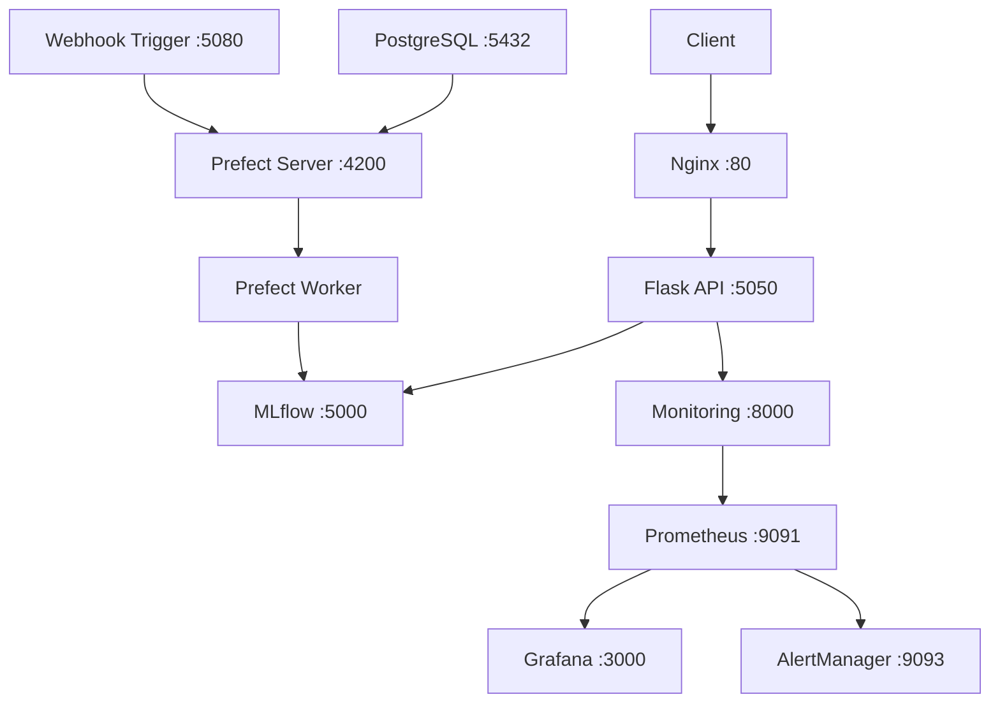
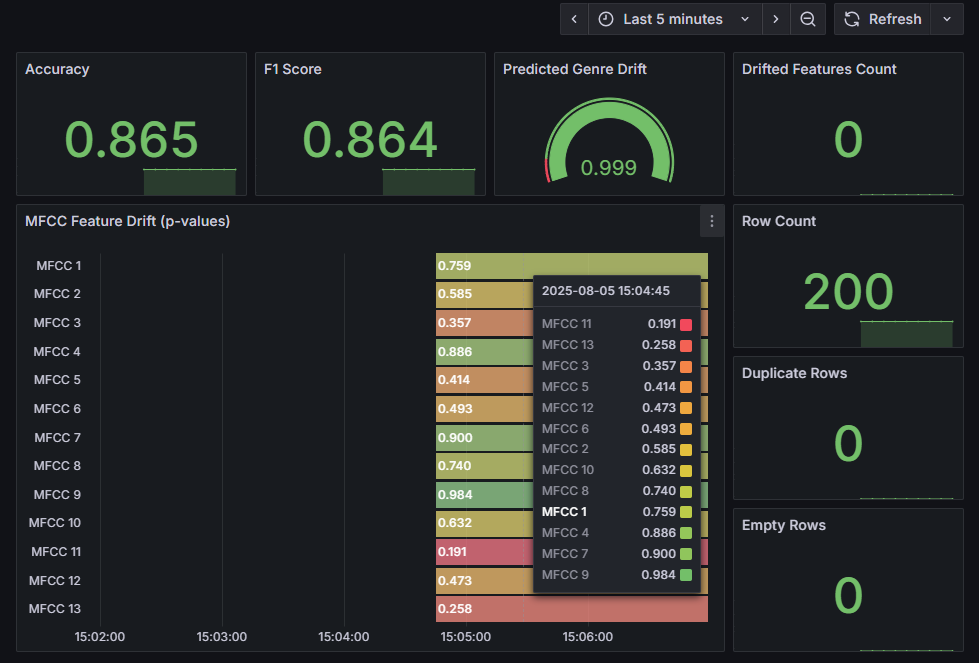
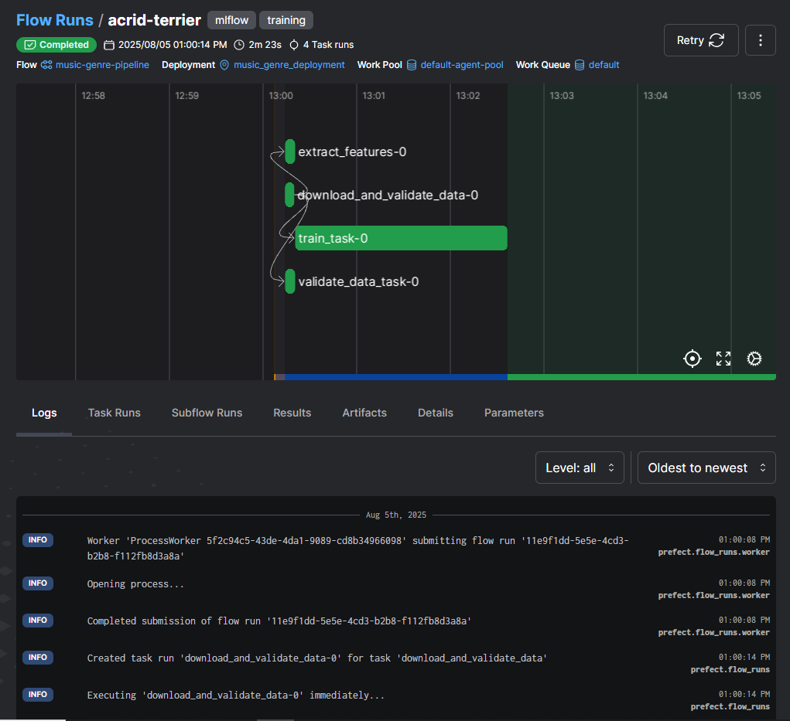

# 🚀 Test & Run Guide

## **Table of Contents**
- [Installation](#installation)
- [Check Code Quality](#check-code-quality)
- [How to Test](#how-to-test)
- [How to Run (with Docker Compose)](#how-to-run-with-docker-compose)
- [Monitoring your first predictions](#monitoring-your-first-predictions)
- [Training a new model](#training-a-new-model)
- [Troubleshooting](#troubleshooting)
- [Next Steps](#next-steps)


## **Installation**

### Prerequisites

Before you begin, ensure you have:
- **Python 3.11+** installed
- **Docker & Docker Compose** installed
- **Git** for cloning the repository
- **8GB RAM** recommended for running all services

### 1️⃣ Clone the Repository
```bash
git clone https://github.com/arsonor/music-genre-classification-with-deep-learning
cd music-genre-classification-with-deep-learning
```

### 2️⃣ Create and Activate a Virtual Environment 
#### 📦 Step 1: Create a Virtual Environment
  ```sh
  python -m venv venv
  ```

#### ✅ Step 2: Activate the virtual environment:
- On macOS/Linux:  
  ```sh
  source venv/bin/activate
  ```
- On Windows (Git Bash):  
  ```sh
  source venv/Scripts/activate
  ```
- On Windows (Command Prompt):  
  ```sh
  venv\Scripts\activate
  ```

### 3️⃣ Run a Complete Development Setup 
```bash
# Option A: Using Makefile (recommended)
make dev-setup

# Option B: Manual setup
bash setup_tests.sh
```

This will:
- ✅ Install all Python dependencies
- ✅ Set up pre-commit hooks for code quality
- ✅ Validate the environment
- ✅ Create necessary directories

## **Check code quality**
```bash
# Option A: Using Makefile
make lint

# Option B: Using python
python check_code_quality.py
```

## **How to Test**

This project includes a **comprehensive testing framework** covering all components:

### 🚀 Quick Testing Commands

```bash
# Run all tests
make test

# Run specific test suites
make test-unit           # Unit tests only
make test-integration    # Integration tests
make test-service        # API service tests
make test-monitoring     # Monitoring tests
make test-classifier     # ML pipeline tests

# Run with test coverage
make test-coverage

# Clean test artifacts
make clean
```

### 🧪 Test Categories

**📊 API Tests (`test_server.py`)**
- Flask endpoint functionality
- Audio file upload handling
- JSON response validation
- Error handling scenarios

**🤖 Service Tests (`test_genre_prediction_service.py`)**
- Model loading and prediction logic
- MFCC feature extraction
- Singleton pattern implementation
- MLflow model registry integration

**🔬 ML Pipeline Tests (`test_classifier.py`)**
- Model architecture validation
- Training pipeline with MLflow mocking
- Data preparation and feature extraction
- Configuration handling

**📈 Monitoring Tests (`test_monitoring.py`)**
- Evidently drift detection
- Prometheus metrics generation
- Data validation and processing

**🔗 Integration Tests (`test_integration.py`)**
- End-to-end API workflow
- Service integration verification
- Data flow validation


## **How to Run (with Docker Compose)**

The project uses **Docker Compose** for orchestrating multiple services in a production-like environment.

### 🐳 Architecture Overview



### 🐳 Start Services
```bash
# Start All Services: Using Makefile
make docker-up-build

# Start All Services: Direct Docker Compose
docker-compose up --build -d

# Start specific services
make monitoring-up    # Just monitoring stack
make mlflow-up       # Just MLflow
make prefect-up      # Just Prefect + database
```

### ⏱️ Wait for Services
```bash
# Check service status
docker-compose ps

# Watch logs (optional)
make docker-logs
```

### 🐳 Access Services

Once everything is running, access these services in your browser:

| Service | URL | Credentials | Description |
|---------|-----|-------------|-------------|
| **🎵 API** | http://localhost | - | Main prediction endpoint |
| **🔬 MLflow** | http://localhost:5000 | - | Model registry & experiments |
| **🌊 Prefect** | http://localhost:4200 | - | Workflow orchestration |
| **📊 Grafana** | http://localhost:3000 | admin/admin | Monitoring dashboards |
| **📈 Prometheus** | http://localhost:9091 | - | Metrics collection |


### 🔧 Service Configuration

**🌐 API Service (Flask + Nginx)**
- **Flask API**: Runs on internal port 5050
- **Nginx Proxy**: External access on port 80
- **Auto-restart**: Enabled for production resilience
- **Volume mounts**: Monitoring data persistence

**🔬 MLflow Tracking**
- **MLflow Server**: Port 5000 with artifact storage
- **Backend**: File-based storage for simplicity
- **Model Registry**: Automatic model versioning
- **Artifacts**: Persistent volume for model storage

**🌊 Prefect Orchestration**
- **Prefect Server**: Port 4200 with PostgreSQL backend
- **Worker Pool**: Dedicated agent for flow execution
- **Health checks**: Automatic service dependency management
- **Flow Deployment**: Automated pipeline scheduling

**📊 Monitoring Stack**
- **Prometheus**: Metrics collection on port 9091
- **Grafana**: Dashboards on port 3000 (admin/admin)
- **AlertManager**: Alert routing on port 9093
- **Evidently**: Model drift detection service


### 💾 Data Persistence

```yaml
volumes:
  prefect_pg_data:        # PostgreSQL data
  grafana_data:          # Grafana configurations
  prometheus_data:       # Prometheus metrics
  ./mlruns:/mlflow/mlruns         # MLflow experiments
  ./monitoring/data:/app/monitoring/data  # Monitoring data
```

### 🛑 Stopping Services

```bash
# Stop all services
make docker-down

# Clean up (removes containers, networks, volumes)
make docker-clean

# Deep clean (includes local data)
make clean-all
```


## **Monitoring Your First Predictions**

### View Predictions in Grafana
1. Go to http://localhost:3000
2. Login with `admin/admin`
3. Navigate to the "Evidently Monitoring Dashboard"
4. Make some predictions and watch the metrics update in real-time

<p align="center">
  
</p>

For more details, go to: [Monitoring Guide](MONITORING.md)

### Check MLflow Experiments
1. Go to http://localhost:5000
2. Browse the "music_genre_classification" experiment
3. View model versions in the Model Registry

## **Training a New Model**

### Trigger Training Pipeline
1. After Docker services are ready (wait until 'default-agent-pool' worker pool is created):
```
prefect-server    | 
prefect-server    |  ___ ___ ___ ___ ___ ___ _____ 
prefect-server    | | _ \ _ \ __| __| __/ __|_   _| 
prefect-server    | |  _/   / _|| _|| _| (__  | |  
prefect-server    | |_| |_|_\___|_| |___\___| |_|  
prefect-server    | 
prefect-server    | Configure Prefect to communicate with the server with:
prefect-server    | 
prefect-server    |     prefect config set PREFECT_API_URL=http://0.0.0.0:4200/api
prefect-server    | 
prefect-server    | View the API reference documentation at http://0.0.0.0:4200/docs
prefect-server    | 
prefect-server    | Check out the dashboard at http://0.0.0.0:4200
prefect-server    | 
prefect-server    | 
prefect-server    | 
prefect-worker    | Work pool 'default-agent-pool' does not exist and no worker type was provided. 
prefect-worker    | Starting a process worker...
prefect-worker    | Worker 'ProcessWorker 5f2c94c5-43de-4da1-9089-cd8b34966098' started!
prefect-worker    | 10:55:07.826 | INFO    | prefect.worker.process.processworker 5f2c94c5-43de-4da1-9089-cd8b34966098 - Work pool 'default-agent-pool' created.
```

2. Run on a new terminal:
```bash
docker exec -it prefect-worker prefect deploy --all

# Or with Makefile:
make prefect-deploy
```

3. Answer a few questions (type n) until the deployment flow is ready to be executed.

4. Start a deployment run:

```bash
# Option A: Using Prefect UI
# 1. Go to http://localhost:4200
# 2. Navigate to Deployments
# 3. Run "music_genre_deployment"

# Option B: Command line
prefect deployment run music-genre-pipeline/music_genre_deployment
```

5. Follow the progression and the finish state:
  - in the prefect UI
  <p align="center">
    
  </p>

  - via Docker logs
  ```
  > Running set_working_directory step...
prefect-worker    | Data found at: /app/classifier/data/data_10.npz
prefect-worker    | Extracted: X (9986, 130, 13), y (9986,)
prefect-worker    | Data validation complete: 9986 samples, (130, 13) feature shape
prefect-worker    | Labels shape: (9986,)
prefect-worker    | Loaded X:(9986, 130, 13, 1), y:(9986,)
prefect-worker    | Epoch 1/15
...
...
prefect-worker    | 11:02:36.923 | INFO    | Flow run 'acrid-terrier' - Finished in state Completed('All states completed.')
prefect-worker    | Training history saved to: training_history.png
prefect-worker    | Model registered. Test accuracy: 0.7538
prefect-worker    | 🏃 View run classy-slug-117 at: http://mlflow:5000/#/experiments/600034235867502708/runs/47f0141f40364182be89497eb4d90b04
  ```

### Local Training (Development)
```bash
# Train model locally
make train-model

# Or manually:
cd classifier
python train.py
```

## **Troubleshooting**

### Common Issues

**🐳 Docker Services Won't Start**
```bash
# Check Docker is running
docker --version
docker-compose --version

# Clean up and restart
make docker-clean
make docker-up
```

**📦 Port Conflicts**
```bash
# Check what's using ports
netstat -an | grep :80
netstat -an | grep :5000

# Stop conflicting services or modify docker-compose.yaml
```

**🔍 API Returns Errors**
```bash
# Check API logs
docker-compose logs api

# Check if model is loaded
docker-compose logs api | grep -i "model"
```

**⚠️ MLflow Model Not Found**
```bash
# Check MLflow is running
curl http://localhost:5000/api/2.0/mlflow/experiments/list

# If no models exist, train one first:
make train-model
```

### Getting Help

**Check Service Status**
```bash
make status           # Overview of all services
docker-compose ps     # Docker container status
make docker-logs      # View all service logs
```

**Reset Everything**
```bash
make clean-all        # Nuclear option - removes all data
make docker-up        # Start fresh
```

## **Next Steps**
**🎵 Congratulations!** You now have a full MLOps pipeline running for music genre classification.
Now that you have the system running:

1. **📖 Learn the Architecture**: [Architecture Guide](ARCHITECTURE.md)
2. **🔄 Explore the API**: [API Documentation](API.md)
3. **📊 Set Up Monitoring**: [Monitoring Guide](MONITORING.md)
4. **🌊 Understand Training**: [Training Pipeline](TRAINING.md)
---