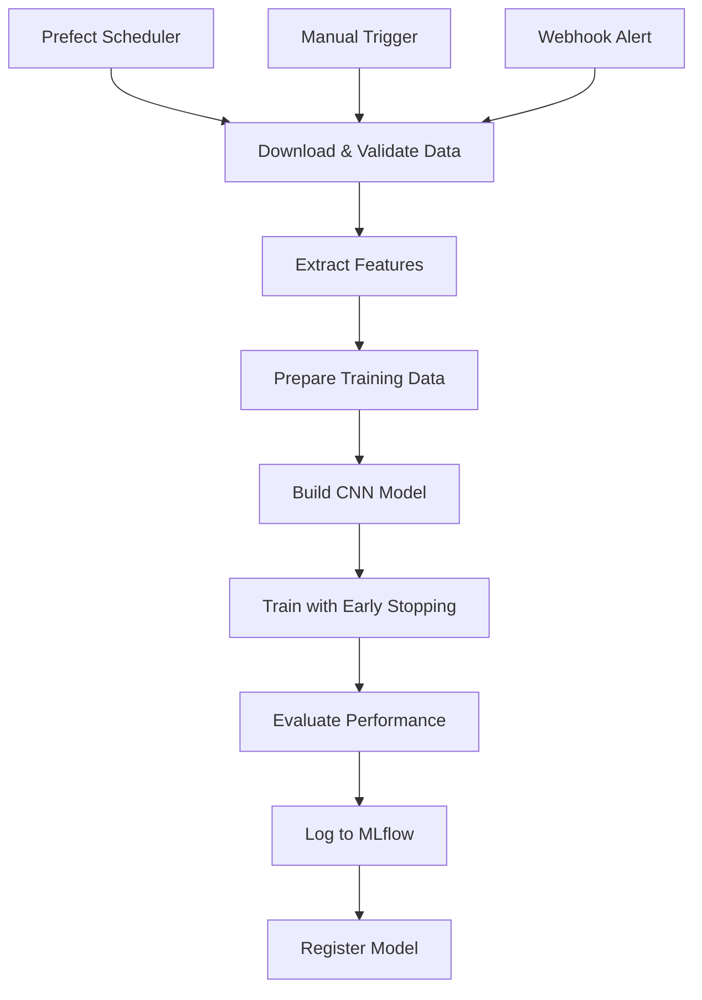

## 🛠 **Training Pipeline (Prefect + MLflow)**

The training pipeline implements **automated ML workflows** with experiment tracking and model versioning.

### **🌊 Prefect Workflow Orchestration**



### **🚀 Pipeline Components**

**Data Validation Task**:
```python
@task
def download_and_validate_data():
    file_path = "classifier/data/data_10.npz"
    if not os.path.exists(file_path):
        raise FileNotFoundError(f"Training data not found: {file_path}")
    return file_path

@task  
def validate_data_task(data_path):
    features, labels = extract_features(data_path)
    print(f"Validation: {features.shape[0]} samples, {labels.shape} labels")
    return features, labels
```

**Training Task with MLflow**:
```python
@task
def train_task(file_path):
    # MLflow experiment setup
    mlflow.set_tracking_uri("http://mlflow:5000")
    mlflow.set_experiment("music_genre_classification")
    
    with mlflow.start_run():
        # Log hyperparameters
        mlflow.log_params({
            "epochs": 100,
            "batch_size": 32,
            "learning_rate": 0.001,
            "l2_reg": 0.001
        })
        
        # Train model with early stopping
        model = build_model(input_shape, l2_reg, learning_rate)
        history = model.fit(X_train, y_train, ...)
        
        # Log metrics and artifacts
        mlflow.log_metrics({"test_accuracy": test_acc})
        mlflow.log_figure(training_plot, "training_history.png")
        mlflow.keras.log_model(model, "model", 
                              registered_model_name="music_genre_tf_model")
```

### **🔬 MLflow Experiment Tracking**

**Comprehensive Logging**:
- **Hyperparameters**: All training configuration
- **Metrics**: Training/validation loss and accuracy
- **Artifacts**: Model files, training plots, configs
- **Model Registry**: Automatic versioning and staging
- **Metadata**: Git commit, environment info, timestamps

**Model Versioning Strategy**:
```yaml
# mlflow_config.yaml
experiment_name: "music_genre_classification"
registered_model_name: "music_genre_tf_model"
training:
  epochs: 100
  batch_size: 32
  learning_rate: 0.001
  l2_reg: 0.001
  patience: 10
```

**MLflow UI Features**:
- **Experiment comparison**: Side-by-side run analysis
- **Model registry**: Production model management
- **Artifact browser**: Download models and plots
- **Metrics visualization**: Interactive training curves

### **🎯 Training Configuration**

**CNN Architecture Hyperparameters**:
- **Learning rate**: 0.001 with Adam optimizer
- **Regularization**: L2 penalty (0.001) + Dropout (0.4)
- **Early stopping**: Patience of 10 epochs on validation accuracy
- **Batch size**: 32 for optimal GPU utilization
- **Epochs**: Up to 100 with early termination

**Data Processing**:
- **Train/Validation/Test split**: 70%/15%/15%
- **Feature normalization**: StandardScaler on MFCC features
- **Data augmentation**: Time-domain and frequency-domain transforms
- **Class balancing**: Equal sampling across 10 genres

### **🔄 Pipeline Triggers**

**Automated Scheduling**:
```python
# Prefect deployment with schedule
@flow(name="music-genre-pipeline")
def music_genre_pipeline():
    data_path = download_and_validate_data()
    features, labels = validate_data_task(data_path)
    training_results = train_task(data_path)
    return training_results
```

**Manual Triggers**:
```bash
# Deploy pipeline to Prefect server
prefect deployment build classifier/prefect_flow.py:music_genre_pipeline -n "music_genre_deployment"
prefect deployment apply music_genre_deployment-deployment.yaml

# Run pipeline manually
prefect deployment run music-genre-pipeline/music_genre_deployment
```

**Webhook Integration**:
- **Drift alerts**: Automatic retraining on model drift
- **Data updates**: Pipeline trigger on new training data
- **Performance degradation**: Retraining below accuracy threshold

### **📊 Pipeline Monitoring**

**Prefect UI Dashboard**:
- **Flow runs**: Real-time execution status
- **Task monitoring**: Individual task success/failure
- **Logs**: Detailed execution logs and errors
- **Scheduling**: Cron-based or interval scheduling

**Integration with Alerting**:
- **Failed runs**: Slack/email notifications
- **Performance metrics**: Training accuracy alerts
- **Resource monitoring**: CPU/memory usage tracking

---